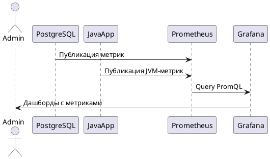
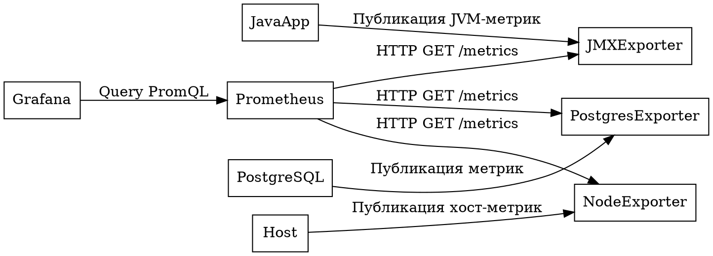

Markdown сам по себе не поддерживает встроенные схемы, но существует несколько популярных расширений и инструментов, которые позволяют добавлять схемы в Markdown-документы. Вот основные форматы и способы создания схем, кроме Mermaid:

---

### **1. ASCII Art**
ASCII Art — это текстовые схемы, созданные с использованием символов клавиатуры. Они просты для понимания и отлично работают в любом Markdown-редакторе, так как не требуют дополнительных инструментов.

#### Пример:
```plaintext
+-------------------+       +-------------------+
|   PostgreSQL      |       |     JavaApp       |
+-------------------+       +-------------------+
         |                         |
         v                         v
+-------------------+       +-------------------+
| PostgresExporter  |       |    JMXExporter    |
+-------------------+       +-------------------+
         |                         |
         +-------------------------+
                    |
                    v
              +-------------+
              | Prometheus  |
              +-------------+
```

**Преимущества:**
- Работает везде, где работает Markdown.
- Простота редактирования.

**Недостатки:**
- Ограниченная сложность схем.
- Требует ручной работы для создания сложных структур.

---

### **2. PlantUML**
PlantUML — это текстовый язык для создания UML-диаграмм (последовательностей, классов, активностей и т.д.). Он поддерживается многими Markdown-редакторами через плагины или внешние инструменты.

#### Пример:


**Преимущества:**
- Поддержка сложных диаграмм (UML, последовательности, классы).
- Интеграция с Markdown через плагины (например, в VS Code).

**Недостатки:**
- Требует установки инструментов для рендеринга.
- Не все Markdown-редакторы поддерживают PlantUML.

---

### **3. Graphviz (DOT)**
Graphviz использует язык DOT для описания графов и диаграмм. Это мощный инструмент для создания сложных графов.

#### Пример:


**Преимущества:**
- Высокая гибкость для создания сложных графов.
- Хорошо подходит для автоматизации.

**Недостатки:**
- Требует инструментов для рендеринга (например, Graphviz).
- Не все Markdown-редакторы поддерживают DOT.

---

### **4. Blockdiag**
Blockdiag — это инструмент для создания блок-схем, аналогичный Graphviz, но с более простым синтаксисом.

#### Пример:
```blockdiag
blockdiag {
    PostgreSQL -> PostgresExporter -> Prometheus;
    JavaApp -> JMXExporter -> Prometheus;
    Host -> NodeExporter -> Prometheus;

    Prometheus -> Grafana [label="Query PromQL"];
    Grafana -> Admin [label="Дашборды"];
}
```

**Преимущества:**
- Простой синтаксис.
- Хорошо подходит для блок-схем.

**Недостатки:**
- Требует установки инструментов для рендеринга.

---

### **5. SVG/HTML Embedding**
Если ваш Markdown-редактор поддерживает встраивание HTML, вы можете использовать SVG-графики. Это позволяет вставить готовые схемы, созданные в таких инструментах, как draw.io, Lucidchart или Adobe Illustrator.

#### Пример:
```html

```

**Преимущества:**
- Полная свобода в создании схем.
- Векторные изображения масштабируются без потери качества.

**Недостатки:**
- Требует внешних инструментов для создания SVG.
- Не является текстовым форматом.

---

### **6. Vega/Vega-Lite**
Vega и Vega-Lite — это декларативные языки для создания интерактивных визуализаций. Они поддерживаются некоторыми Markdown-редакторами (например, Jupyter Notebook).

#### Пример:
```json
{
  "$schema": "https://vega.github.io/schema/vega-lite/v5.json",
  "data": {
    "values": [
      {"source": "PostgreSQL", "target": "Prometheus"},
      {"source": "JavaApp", "target": "Prometheus"},
      {"source": "Prometheus", "target": "Grafana"}
    ]
  },
  "mark": "line",
  "encoding": {
    "x": {"field": "source", "type": "nominal"},
    "y": {"field": "target", "type": "nominal"}
  }
}
```

**Преимущества:**
- Интерактивные и динамические схемы.
- Подходит для сложных данных.

**Недостатки:**
- Сложный синтаксис.
- Требует поддержки редактора.

---

### **7. Скриншоты/Изображения**
Если ни один из вышеупомянутых методов не подходит, вы всегда можете создать схему в графическом редакторе (например, draw.io, Lucidchart, PowerPoint) и вставить её в Markdown как изображение.

#### Пример:
```markdown

```

**Преимущества:**
- Универсальность.
- Простота использования.

**Недостатки:**
- Нет возможности редактировать схему напрямую в Markdown.

---

### **Рекомендации**
Если вам нужна простота и универсальность, начните с **ASCII Art** или **Mermaid**. Если требуется большая гибкость, рассмотрите **PlantUML**, **Graphviz** или **Vega-Lite**. Для профессиональных презентаций используйте **SVG** или **draw.io**.
