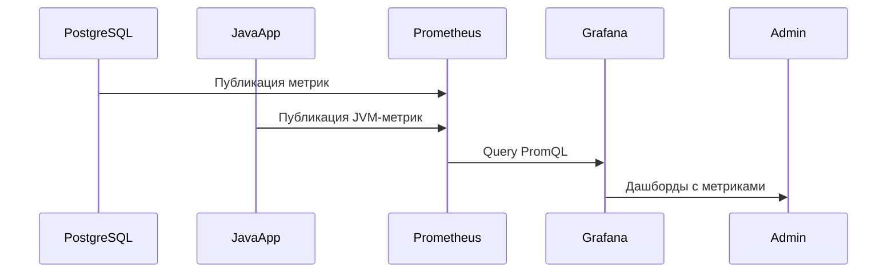

GitHub поддерживает **Markdown** (`.md` файлы) и позволяет встраивать схемы только через определенные инструменты. Вот список способов, которые работают нативно или через расширения на GitHub:

---

### **1. Mermaid**
GitHub **нативно поддерживает Mermaid** начиная с 2022 года. Это самый удобный способ добавить схемы в Markdown-файлы.

#### Пример:



**Преимущества:**
- Нативная поддержка GitHub.
- Простой синтаксис.
- Поддержка различных типов диаграмм (последовательности, блок-схемы, графы).

**Недостатки:**
- Ограниченные возможности для очень сложных схем.

---

### **2. ASCII Art**
ASCII Art работает везде, где работает Markdown, включая GitHub.

#### Пример:
```plaintext
+-------------------+       +-------------------+
|   PostgreSQL      |       |     JavaApp       |
+-------------------+       +-------------------+
         |                         |
         v                         v
+-------------------+       +-------------------+
| PostgresExporter  |       |    JMXExporter    |
+-------------------+       +-------------------+
         |                         |
         +-------------------------+
                    |
                    v
              +-------------+
              | Prometheus  |
              +-------------+
```

**Преимущества:**
- Работает без дополнительных инструментов.
- Совместимость со всеми Markdown-редакторами.

**Недостатки:**
- Ограниченная сложность.
- Трудно редактировать большие схемы.

---

### **3. Встраивание изображений (SVG/PNG)**
GitHub поддерживает встраивание изображений (включая SVG). Вы можете создать схему в инструментах, таких как **draw.io**, **Lucidchart**, или даже вручную, а затем загрузить её в репозиторий и сослаться на неё.

#### Пример:
```markdown

```

**Преимущества:**
- Полная свобода в создании схем.
- Поддержка сложных и красивых визуализаций.

**Недостатки:**
- Требует внешних инструментов.
- Не редактируется напрямую в Markdown.

---

### **4. PlantUML (через сторонние сервисы)**
GitHub сам по себе **не поддерживает PlantUML**, но вы можете использовать сторонние сервисы, такие как [PlantText](https://www.planttext.com/) или [PlantUML Server](http://www.plantuml.com/plantuml/), чтобы создать схему и встроить её как изображение.

#### Шаги:
1. Создайте схему на [PlantText](https://www.planttext.com/).
2. Экспортируйте её как PNG/SVG.
3. Загрузите изображение в репозиторий и вставьте ссылку в Markdown.

#### Пример:
```markdown

```

**Преимущества:**
- Поддержка сложных UML-диаграмм.
- Хорошо подходит для профессиональной документации.

**Недостатки:**
- Требует дополнительных шагов для экспорта и встраивания.
- Не редактируется напрямую в Markdown.

---

### **5. Graphviz (через сторонние сервисы)**
Как и PlantUML, GitHub не поддерживает Graphviz напрямую. Однако вы можете использовать сторонние сервисы, такие как [Graphviz Online](https://dreampuf.github.io/GraphvizOnline/), чтобы создать схему и встроить её как изображение.

#### Пример:


**Преимущества:**
- Поддержка сложных графов.
- Гибкость в создании диаграмм.

**Недостатки:**
- Требует внешних инструментов.
- Не редактируется напрямую в Markdown.

---

### **6. Vega/Vega-Lite (через GitHub Actions или сторонние сервисы)**
GitHub не поддерживает Vega/Vega-Lite напрямую, но вы можете использовать их для создания интерактивных схем и встраивать их через сторонние сервисы или хостинг.

#### Пример:


**Преимущества:**
- Интерактивные схемы.
- Подходит для сложных данных.

**Недостатки:**
- Сложный синтаксис.
- Требует внешних инструментов.

---

### **Рекомендация для GitHub**
Для работы на GitHub рекомендуется использовать **Mermaid**, так как это нативно поддерживаемый формат, который легко интегрируется в Markdown. Если вам нужна более сложная схема, используйте **ASCII Art** или **встраивание изображений**.

Если у вас есть конкретные требования к схеме, я могу помочь адаптировать её под один из этих форматов!
