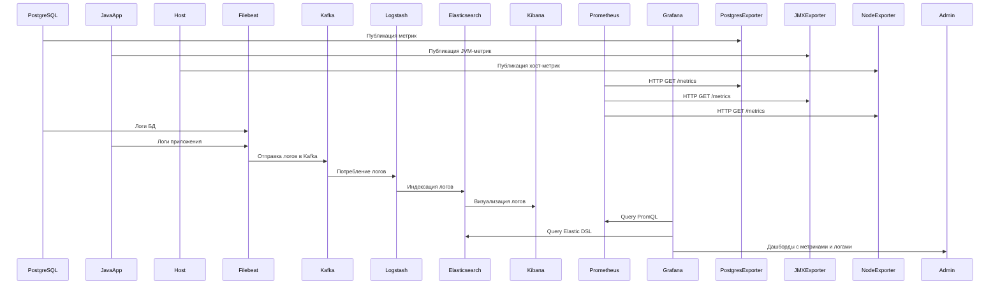

# Введение

## Мониторинг

### 1. Зачем нужен мониторинг?

Представьте, что вы разрабатываете веб-приложение или управляете сервером. Все работает отлично, пользователи довольны, бизнес процветает. Но внезапно что-то идет не так: сайт становится недоступным, база данных перестает отвечать, а пользователи начинают массово жаловаться. Что произошло? Где проблема? Как её исправить?

Чтобы избежать таких ситуаций, существует **мониторинг** — система, которая помогает вам "видеть" состояние вашего приложения и инфраструктуры в режиме реального времени. Мониторинг — это не просто наблюдение за цифрами, это ваш надежный помощник, который:

1. **Спасает вас от сбоев**:  
   Представьте, что ваш сервер перегружен, и процессор работает на 100%. Без мониторинга вы узнаете об этом только тогда, когда пользователи начнут жаловаться. А с мониторингом вы получите уведомление заранее, чтобы предотвратить катастрофу.

2. **Помогает планировать будущее**:  
   Если количество пользователей растет, рано или поздно вам потребуется больше ресурсов (например, увеличить объем оперативной памяти или добавить серверы). Мониторинг покажет, когда именно нужно масштабироваться, чтобы избежать проблем.

3. **Обеспечивает выполнение обязательств перед клиентами**:  
   Если вы предоставляете услугу, то, скорее всего, заключили соглашение об уровне обслуживания (SLA). Например, ваш сайт должен быть доступен 99.9% времени. Мониторинг поможет вам контролировать выполнение этих обязательств и избежать штрафов.

4. **Помогает экономить деньги**:  
   Зачем платить за лишние мощности, если они не используются? Мониторинг покажет, какие ресурсы задействованы, а какие можно освободить, чтобы снизить затраты.

---

### 2. Почему мониторинг важен для вас?

На этом курсе вы научитесь создавать системы, которые будут работать стабильно и эффективно. Вы узнаете, как:
- Следить за состоянием серверов, баз данных и приложений.
- Быстро находить и устранять проблемы.
- Создавать дашборды, чтобы наглядно видеть, как работает ваша система.
- Научитесь предсказывать нагрузку и масштабировать ресурсы.

Эти навыки пригодятся вам не только в учебе, но и в работе. Современные компании ожидают, что их специалисты умеют настраивать мониторинг и анализировать данные, чтобы поддерживать высокую производительность и надежность систем.

---

### 3. Что такое мониторинг простыми словами?

Мониторинг — это как пульт управления вашим автомобилем. Он показывает, сколько бензина осталось, какая температура двигателя, работает ли кондиционер. Если что-то сломается, вы сразу увидите красную лампочку на панели. В случае с серверами и приложениями мониторинг выполняет ту же роль: он собирает информацию о состоянии системы, анализирует её и предупреждает вас, если что-то идет не так.

---

### 4. Основные цели мониторинга:

1. **Обнаружение аномалий и сбоев в реальном времени**:  
   Вы узнаете о проблемах до того, как они повлияют на пользователей.

2. **Прогнозирование нагрузки и масштабирование ресурсов**:  
   Вы сможете заранее подготовиться к росту числа пользователей или увеличению трафика.

3. **Аудит соответствия SLA**:  
   Вы будете уверены, что ваш сервис работает в рамках согласованных обязательств.

4. **Оптимизация использования ресурсов**:  
   Вы сможете эффективно использовать CPU, RAM, дисковое пространство и сеть, не переплачивая за лишние мощности.

---

Теперь, когда вы понимаете, зачем нужен мониторинг, давайте рассмотрим, какие инструменты помогут вам достичь этих целей. Мы поговорим о Prometheus, Grafana, ELK и других технологиях, которые составляют современный стек мониторинга.

---

### 5. Описание стека мониторинга

В современных ИТ-экосистемах мониторинг становится не просто инструментом контроля, а основным элементом управления инфраструктурой. Особенно это актуально для сложных распределенных систем, где требуется не только отслеживать текущее состояние, но и предсказывать будущие проблемы. Здесь на помощь приходят мощные решения, такие как Prometheus/Mimir для сбора метрик, ELK (Elasticsearch, Logstash, Kibana) для анализа логов и Grafana для визуализации данных.  

Каждый компонент этого стека выполняет свою уникальную роль:  
- **Prometheus/Mimir** обеспечивает точный сбор метрик в реальном времени, используя pull-модель и мощный язык запросов PromQL.  
- **ELK** предоставляет централизованное хранение и анализ логов, позволяя быстро находить ошибки и выявлять тренды.  
- **Grafana** объединяет все данные в единые дашборды, создавая удобный интерфейс для мониторинга и принятия решений.  

Рассмотрим, как эти компоненты взаимодействуют между собой и как их можно использовать для создания надежной системы мониторинга.

---

### 6. Схема взаимодействия компонентов нашего будущего стека

<!-- ### sequenceDiagram

-->

### **Описание схемы**

1. **Сбор метрик**:
   - **PostgreSQL**, **JavaApp** и **Host** публикуют метрики через соответствующие экспортеры (например, `PostgresExporter`, `JMXExporter`, `NodeExporter`).  
   - **Prometheus** забирает метрики через HTTP GET `/metrics` (pull-метод).  

2. **Сбор логов**:
   - **PostgreSQL** и **JavaApp** отправляют свои логи в **Filebeat**.  
   - **Filebeat** передает логи в **Kafka** для буферизации и распределения.  

3. **Обработка логов через ELK**:
   - **Kafka** отправляет логи в **Logstash** для обработки (фильтрация, парсинг).  
   - **Logstash** индексирует логи в **Elasticsearch**.  
   - **Kibana** визуализирует логи для анализа.  

4. **Анализ и визуализация**:
   - **Grafana** подключается к **Prometheus** для анализа метрик через PromQL.  
   - **Grafana** также подключается к **Elasticsearch** для анализа логов через Elastic DSL.  
   - Результаты отображаются на дашбордах (например, тренды нагрузки на PostgreSQL, статус репликации, ошибки Nginx).  

5. **Оповещение**:
   - **Prometheus** может отправлять алерты в **Alertmanager**, который уведомляет администраторов через Slack, Email или Telegram.  

### 7. Виды мониторинга

**Виды мониторинга по типу собираемых данных:**
- Мониторинг метрик (CPU, RAM, дисковое пространство)
- Мониторинг логов (журналы событий, ошибки)
- Трассировка распределенных систем (отслеживание запросов через несколько сервисов)
- Мониторинг бизнес-метрик (конверсии, выручка)

**Виды мониторинга по способу сбора данных:**
- Push-мониторинг (агенты отправляют данные в систему)
- Pull-мониторинг (система запрашивает данные у агентов)
- Гибридный подход (комбинирование push и pull методов)

**Виды мониторинга по масштабируемости и архитектуре:**
- Централизованный мониторинг (единая система сбора и анализа)
- Распределенный мониторинг (несколько независимых систем)
- Микросервисный мониторинг (индивидуальный мониторинг каждого микросервиса)
- Кластерный мониторинг (наблюдение за кластерами серверов)

---

### **Итог**
- **Prometheus** активно забирает метрики из всех экспортеров (pull-метод).  
- **Kafka** дополняет мониторинг, обеспечивая надежную доставку логов.  
- **ELK** анализирует логи, а **Grafana** объединяет метрики и логи в единой панели.
