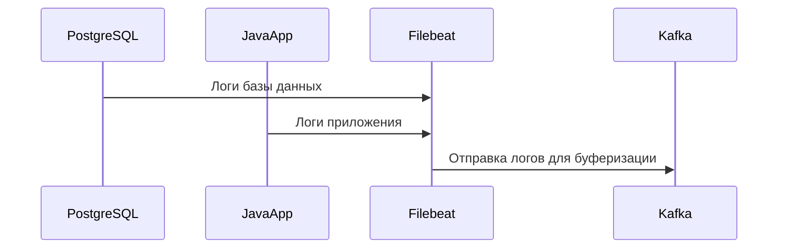

### **Сбор логов**

Логи — это текстовые данные, которые содержат информацию о работе приложений и инфраструктуры. Они помогают выявлять ошибки, анализировать события и исследовать причины сбоев. В отличие от метрик, логи могут быть неструктурированными или полуструктурированными.

### **Сбор логов**



- **PostgreSQL** и **JavaApp**:
  - Эти компоненты генерируют логи, которые содержат информацию о запросах, ошибках, предупреждениях и других событиях.
  - Пример логов PostgreSQL:
    ```plaintext
    2023-10-01 12:00:00 LOG:  checkpoint starting: time
    2023-10-01 12:00:01 ERROR:  deadlock detected
    ```
  - Пример логов JavaApp:
    ```plaintext
    [INFO] 2023-10-01 12:05:00 Starting application...
    [ERROR] 2023-10-01 12:10:00 NullPointerException in module X
    ```

- **Filebeat**:
  - Filebeat — это легковесный агент, который собирает логи с файловой системы и отправляет их в Kafka.
  - Преимущества Filebeat:
    - Малое потребление ресурсов.
    - Поддержка различных форматов логов.
    - Возможность буферизации данных для надежной доставки.

- **Kafka**:
  - Kafka используется для буферизации и распределения логов между различными компонентами системы.
  - Преимущества Kafka:
    - Высокая производительность и масштабируемость.
    - Гарантированная доставка данных даже при сбоях.
    - Возможность параллельной обработки данных несколькими потребителями.

