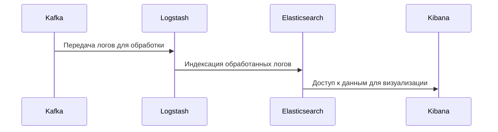

### **Обработка логов через ELK**

ELK (Elasticsearch, Logstash, Kibana) — это популярный стек для централизованного сбора, анализа и визуализации логов. Рассмотрим каждый компонент подробнее:

### **Обработка логов через ELK**



- **Logstash**:
  - Logstash получает логи из Kafka и выполняет их обработку:
    - **Фильтрация**: Удаление ненужных данных или шумовых записей.
    - **Парсинг**: Преобразование неструктурированных логов в структурированный формат (JSON).
    - **Обогащение**: Добавление дополнительной информации (например, геолокация по IP-адресу).
  - Пример конфигурации Logstash:
    ```plaintext
    filter {
      grok {
        match => { "message" => "%{TIMESTAMP_ISO8601:timestamp} %{LOGLEVEL:level} %{GREEDYDATA:message}" }
      }
    }
    ```

- **Elasticsearch**:
  - Elasticsearch индексирует обработанные логи для быстрого поиска и анализа.
  - Преимущества Elasticsearch:
    - Мощный язык запросов (Elastic DSL).
    - Поддержка полнотекстового поиска.
    - Горизонтальная масштабируемость.

- **Kibana**:
  - Kibana предоставляет удобный интерфейс для визуализации логов:
    - **Поиск**: Быстрый поиск ошибок, предупреждений или конкретных событий.
    - **Дашборды**: Создание графиков, таблиц и других визуализаций.
    - **Анализ трендов**: Исследование изменений в логах за определенный период времени.
