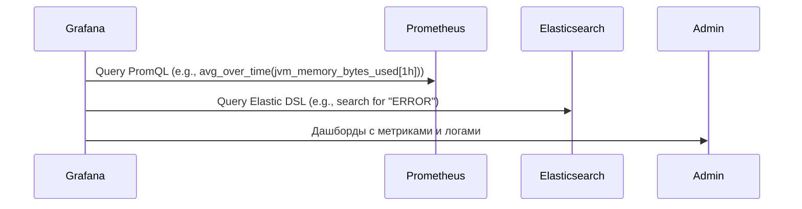

### **Анализ и визуализация**

На этом этапе все собранные данные (метрики и логи) объединяются в единой системе для анализа и визуализации.

### **Схема анализа и визуализации**



- **Grafana**:
  - Grafana подключается к **Prometheus** и **Elasticsearch** для получения данных:
    - **Prometheus**: Используется PromQL (Prometheus Query Language) для анализа метрик. Пример запроса:
      ```promql
      rate(http_requests_total[5m])
      ```
    - **Elasticsearch**: Используется Elastic DSL для анализа логов. Пример запроса:
      ```json
      {
        "query": {
          "match": {
            "level": "ERROR"
          }
        }
      }
      ```
  - Grafana создает дашборды, которые позволяют видеть полную картину состояния системы:
    - **Метрики**: Тренды использования ресурсов, производительность приложений, статус репликации базы данных.
    - **Логи**: Ошибки, предупреждения, ключевые события.
