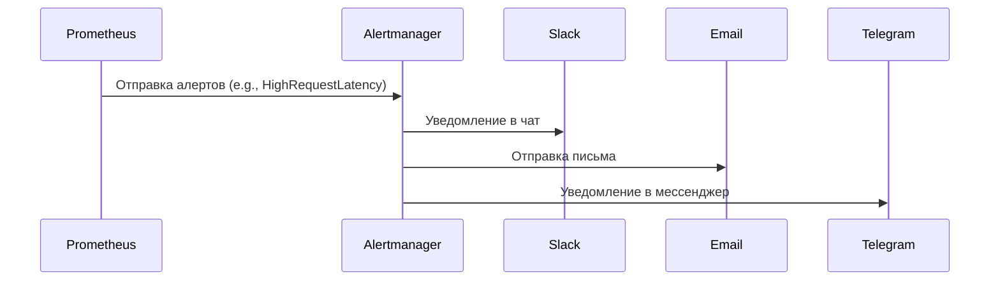

### **Оповещение**

Оповещение — это механизм, который информирует администраторов о проблемах в системе. Это критически важный компонент мониторинга, так как он позволяет быстро реагировать на инциденты.

### **Схема оповещения**



- **Prometheus Alertmanager**:
  - Alertmanager получает алерты от Prometheus и отправляет уведомления через различные каналы:
    - **Slack**: Сообщения в чат для команды разработчиков.
    - **Email**: Письма для ответственных лиц.
    - **Telegram**: Уведомления в мессенджере.
  - Пример правила алерта в Prometheus:
    ```yaml
    groups:
    - name: example
      rules:
      - alert: HighRequestLatency
        expr: job:request_latency_seconds:mean5m{job="myjob"} > 0.5
        for: 10m
        labels:
          severity: critical
        annotations:
          summary: "High request latency on {{ $labels.job }}"
          description: "{{ $labels.job }} has a latency above 500ms (current value: {{ $value }})"
    ```
