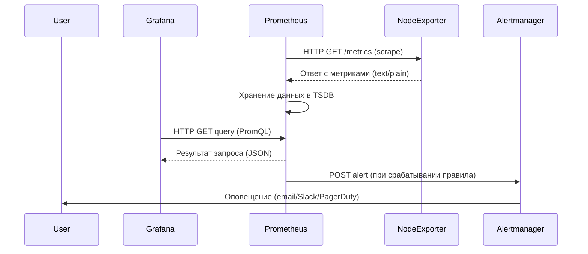
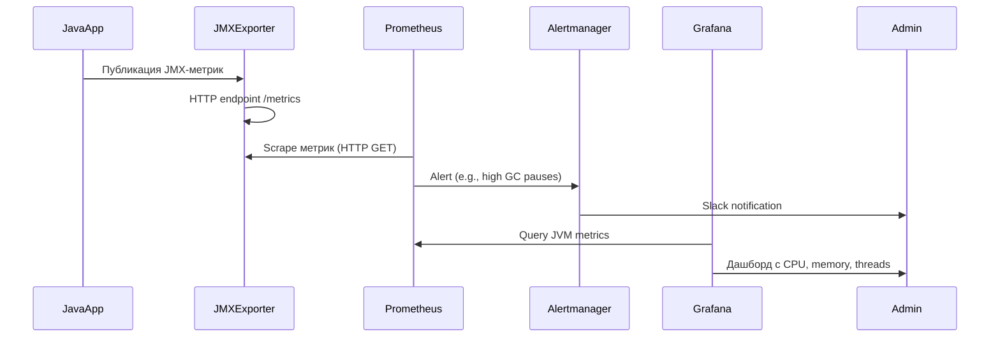
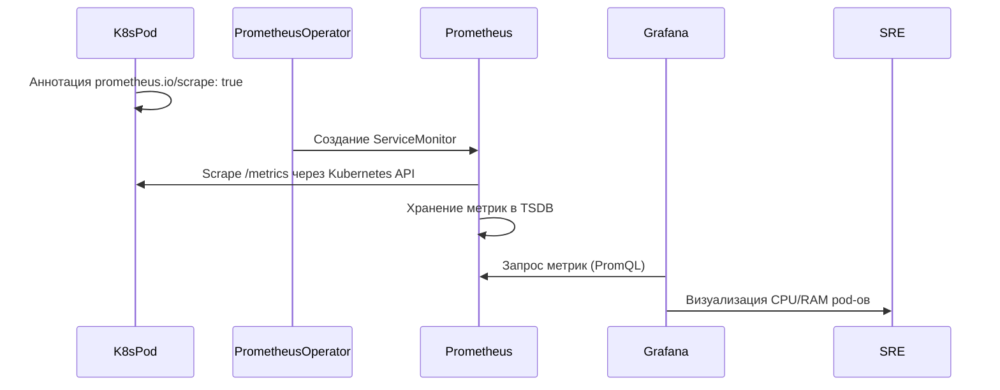

### 1. Введение в мониторинг
Мониторинг — это процесс непрерывного сбора, анализа и визуализации метрик ИТ-инфраструктуры и приложений для обеспечения их надежности, производительности и безопасности.  
**Цели мониторинга**:  
- Обнаружение аномалий и сбоев в реальном времени.  
- Прогнозирование нагрузки и масштабирование ресурсов.  
- Аудит соответствия SLA (Service Level Agreement).  
- Оптимизация использования ресурсов (CPU, RAM, disk I/O, network).  

---

### 1.1 Сравнение Prometheus и Zabbix. Роль зонтичного мониторинга

| **Критерий**          | **Prometheus + экспортеры**                          | **Zabbix + агенты**                                  |
|------------------------|------------------------------------------------------|-----------------------------------------------------|
| **Архитектура**        | Pull-based (метрики забираются по HTTP)             | Push/pull-based (агенты отправляют данные на сервер)|
| **Сбор данных**        | Экспортеры (например, Node Exporter, Blackbox)       | Агенты (Zabbix Agent, SNMP)                         |
| **Масштабируемость**   | Горизонтальная (через federation и Thanos)           | Вертикальная (требует ресурсов на сервере)          |
| **Интеграции**         | Нативная поддержка Kubernetes, облачных сервисов     | Широкий спектр шаблонов для HW/SW                   |
| **Оповещения**         | Alertmanager (гибкие правила на PromQL)              | Встроенные триггеры и уведомления                   |
| **Типовые кейсы**      | Контейнеризированные среды, микросервисы             | Enterprise-инфраструктура, legacy-системы           |

**Зонтичный мониторинг** — унификация данных из разных источников (Prometheus, Zabbix, CloudWatch) в единой системе (например, Grafana) для комплексного анализа.

---

### 2. Grafana: визуализация данных
**Grafana** — платформа для создания дашбордов и анализа метрик.  
**Пример**:  
- Источник данных: Prometheus (CPU usage).  
- Визуализация: График загрузки CPU с алертингом при превышении 90%.  
**Роль**:  
- Агрегация данных из Prometheus, Zabbix, Elasticsearch и других.  
- Настройка оповещений через Alerting Engine.  

---

### 2.1 Prometheus: сбор метрик
**Prometheus** — TSDB (Time Series Database) для мониторинга динамических сред.  
**Зачем нужен**:  
- Забирает метрики по HTTP (pull-метод).  
- Использует PromQL для сложных запросов.  
- Интегрируется с Kubernetes через Service Discovery.  

---

### 2.2 Экспортеры: Node Exporter
**Экспортер** — сервис, предоставляющий метрики в формате, понятном Prometheus.  
**Node Exporter**:  
- Собирает данные о CPU, RAM, дисках, сетевых интерфейсах.  
- Запускается на каждом узле и предоставляет `/metrics` по HTTP.  

---

### 2.3 Mermaid Sequence Diagram


---

### 3. Mermaid Quadrant Chart
```mermaid
quadrantChart
    title Мониторинг 10 ВМ через Node Exporter
    x-axis Сложность интеграции --> Простота
    y-axis Централизация --> Децентрализация
    quadrant-1 Prometheus Server
    quadrant-2 Node Exporters
    quadrant-3 Alertmanager
    quadrant-4 Grafana
    NodeExporter1: 10, 20
    NodeExporter2: 15, 25
    Prometheus: 70, 80
    Grafana: 85, 85
    Alertmanager: 60, 60
```

**Процессы**:  
1. **Node Exporters** публикуют метрики на порту 9100.  
2. **Prometheus** скребет данные по HTTP каждые 15 секунд.  
3. **Alertmanager** получает алерты при превышении пороговых значений.  
4. **Grafana** визуализирует метрики через дашборды.  

---

### 4. Мониторинг в финтехе
**Мониторят**:  
- **Инфраструктура**: Загрузка серверов, сетевая latency.  
- **Приложения**: Время обработки транзакций, ошибки API.  
- **Безопасность**: Количество несанкционированных запросов.  
- **Пользователи**: DAU (Daily Active Users), конверсии.  

**Роль в финтехе**:  
- Обеспечение 99.99% uptime для платежных шлюзов.  
- Обнаружение фрода через аномалии в транзакциях.  

---

### 5. Sequence Diagram: Java-приложение в ВМ


---

### 6. Sequence Diagram: Java-приложение в Kubernetes


---

### 7. Завершение
**Итог**:  
- Prometheus + Grafana = стандарт де-факто для облачных и контейнеризированных сред.  
- Zabbix эффективен для гибридных инфраструктур с legacy-системами.  
- В финтехе мониторинг критичен для соблюдения SLA и защиты от фрода.  
- Используйте **зонтичные решения** для унификации данных из множества источников.  
- **Алертинг** должен быть настроен по принципу SRE (Service Level Objectives).  

