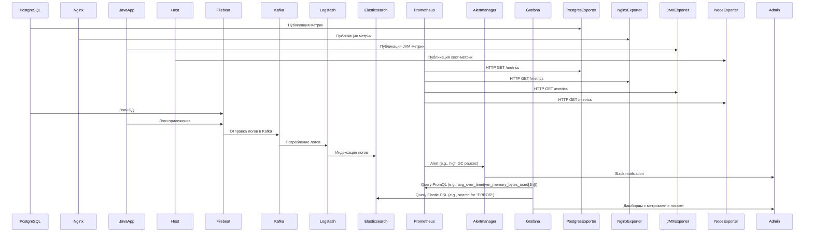

### 1. Введение в мониторинг
**Мониторинг** — это процесс непрерывного сбора, анализа и визуализации метрик ИТ-инфраструктуры и приложений для обеспечения их надежности, производительности и безопасности.  

**Цели мониторинга**:  
- Обнаружение аномалий и сбоев в реальном времени.  
- Прогнозирование нагрузки и масштабирование ресурсов.  
- Аудит соответствия SLA (Service Level Agreement).  
- Оптимизация использования ресурсов (CPU, RAM, disk I/O, network).  

---

### 1.1 Сравнение Prometheus/Mimir и Zabbix. Роль зонтичного мониторинга

| **Критерий**          | **Prometheus/Mimir + экспортеры**                    | **Zabbix + агенты**                                  |
|------------------------|------------------------------------------------------|-----------------------------------------------------|
| **Архитектура**        | Pull-based (метрики забираются по HTTP)             | Push/pull-based (агенты отправляют данные на сервер)|
| **Сбор данных**        | Экспортеры (Node Exporter, JMX Exporter, Postgres Exporter, Nginx Exporter) | Агенты (Zabbix Agent, SNMP)                         |
| **Масштабируемость**   | Горизонтальная (Mimir, Thanos)                       | Вертикальная (требует ресурсов на сервере)          |
| **Интеграции**         | PostgreSQL, Nginx, Kubernetes, ELK, Java-приложения  | Широкий спектр шаблонов для HW/SW                   |
| **Оповещения**         | Alertmanager (гибкие правила на PromQL)              | Встроенные триггеры и уведомления                   |
| **Типовые кейсы**      | Контейнеризированные среды, микросервисы, СУБД       | Enterprise-инфраструктура, legacy-системы           |

**Зонтичный мониторинг** — унификация данных из Prometheus/Mimir, ELK, Zabbix и PostgreSQL в единой системе (Grafana) для комплексного анализа.

---

### 2. Grafana: визуализация данных
**Grafana** — платформа для создания дашбордов и анализа метрик.  
**Пример для финтеха**:  
- Источник данных: Prometheus (метрики Java-приложения, PostgreSQL, Nginx) + Elasticsearch (логи транзакций).  
- Визуализация: График latency транзакций + тренды использования JVM Heap + статус репликации PostgreSQL.  

---

### 2.1 Prometheus/Mimir: сбор метрик
**Prometheus/Mimir** — TSDB для мониторинга динамических сред.  
**Зачем нужен**:  
- Забирает метрики через pull-метод (например, `/metrics` у PostgreSQL Exporter).  
- Использует PromQL для анализа (например, `rate(nginx_http_requests_total[5m])`).  
- **Mimir** — распределенная версия Prometheus для больших объемов данных.  

---

### 2.2 Экспортеры: Node Exporter, JMX Exporter, Postgres Exporter, Nginx Exporter
- **Node Exporter**: Собирает метрики хоста (CPU, RAM, диски).  
- **JMX Exporter**: Экспортирует метрики JVM (heap memory, GC pauses).  
- **Postgres Exporter**:  
  - Собирает метрики PostgreSQL:  
    ```bash
    # Пример конфигурации:
    DATA_SOURCE_NAME="user=postgres host=localhost port=5432" ./postgres_exporter
    ```
  - Метрики: `pg_stat_activity`, `pg_database_size`, репликация.  
- **Nginx Exporter**:  
  - Собирает метрики через `stub_status`:  
    ```nginx
    location /nginx_status {
        stub_status on;
        allow 127.0.0.1;
        deny all;
    }
    ```
  - Метрики: `nginx_http_requests_total`, `nginx_connections_active`.  

---



