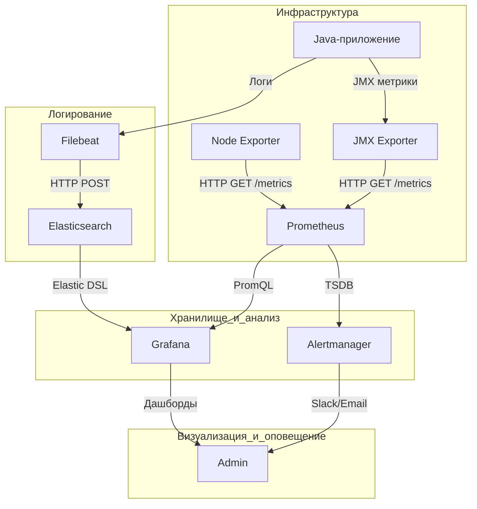

### 1. Введение в мониторинг
Мониторинг — это процесс непрерывного сбора, анализа и визуализации метрик ИТ-инфраструктуры и приложений для обеспечения их надежности, производительности и безопасности.  
**Цели мониторинга**:  
- Обнаружение аномалий и сбоев в реальном времени.  
- Прогнозирование нагрузки и масштабирование ресурсов.  
- Аудит соответствия SLA (Service Level Agreement).  
- Оптимизация использования ресурсов (CPU, RAM, disk I/O, network).  

---

### 1.1 Сравнение Prometheus и Zabbix. Роль зонтичного мониторинга

| **Критерий**          | **Prometheus + экспортеры**                          | **Zabbix + агенты**                                  |
|------------------------|------------------------------------------------------|-----------------------------------------------------|
| **Архитектура**        | Pull-based (метрики забираются по HTTP)             | Push/pull-based (агенты отправляют данные на сервер)|
| **Сбор данных**        | Экспортеры (Node Exporter, JMX Exporter)             | Агенты (Zabbix Agent, SNMP)                         |
| **Масштабируемость**   | Горизонтальная (через federation и Thanos)           | Вертикальная (требует ресурсов на сервере)          |
| **Интеграции**         | Нативная поддержка Kubernetes, ELK, Java-приложений  | Широкий спектр шаблонов для HW/SW                   |
| **Оповещения**         | Alertmanager (гибкие правила на PromQL)              | Встроенные триггеры и уведомления                   |
| **Типовые кейсы**      | Контейнеризированные среды, микросервисы             | Enterprise-инфраструктура, legacy-системы           |

**Зонтичный мониторинг** — унификация данных из Prometheus, ELK и Zabbix в единой системе (Grafana) для комплексного анализа.

---

### 2. Grafana: визуализация данных
**Grafana** — платформа для создания дашбордов и анализа метрик.  
**Пример для финтеха**:  
- Источник данных: Prometheus (метрики Java-приложения) + Elasticsearch (логи транзакций).  
- Визуализация: График latency транзакций + тренды использования JVM Heap.  

---

### 2.1 Prometheus: сбор метрик
**Prometheus** — TSDB для мониторинга динамических сред.  
**Зачем нужен**:  
- Забирает метрики Java-приложений через JMX Exporter.  
- Использует PromQL для анализа (например, `rate(transaction_failures_total[5m])`).  
- Интеграция с ELK через `prometheus-elasticsearch-exporter`.  

---

### 2.2 Экспортеры: Node Exporter и JMX Exporter
**Node Exporter**:  
- Собирает метрики хоста (CPU, RAM, диски).  
**JMX Exporter**:  
- Экспортирует метрики JVM (heap memory, GC pauses, thread count).  
- Внедряется через Java Agent: `-javaagent:jmx_prometheus_javaagent.jar=9404:config.yaml`.  

---

### 2.3 Flowchart TD: Grafana + Prometheus + Node Exporter + Alertmanager

**Этапы**:  
1. **Сбор метрик**:  
   - Node Exporter публикует метрики хоста (CPU, RAM) на порту 9100.  
   - JMX Exporter экспортирует JVM-метрики (heap, threads) на порту 9404.  
2. **Агрегация**:  
   - Prometheus забирает данные через HTTP GET (pull-метод) каждые 15 секунд.  
3. **Хранение**:  
   - Метрики сохраняются в TSDB Prometheus.  
4. **Анализ**:  
   - Grafana запрашивает данные через PromQL (например, `avg_over_time(jvm_memory_bytes_used[1h])`).  
5. **Оповещение**:  
   - Alertmanager отправляет уведомления при превышении порогов (например, 95% CPU).  
6. **Логирование**:  
   - Filebeat отправляет логи Java-приложения в Elasticsearch.  
   - Grafana визуализирует логи через Kibana.  

---

### 5. Завершение
**Итог**:  
- **Flowchart TD** визуализирует поток данных от Java-приложений до дашбордов.  
- **ELK** критичен для анализа логов транзакций и обнаружения фрода.  
- **Prometheus + JMX Exporter** — стандарт для мониторинга JVM.  
- **Рекомендация**:  
  - Используйте `histogram_quantile()` для анализа SLA.  
  - Интегрируйте Kibana для поиска аномалий в логах.  
