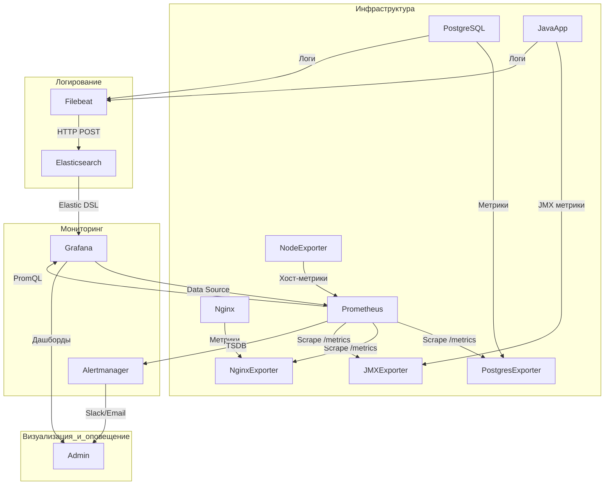
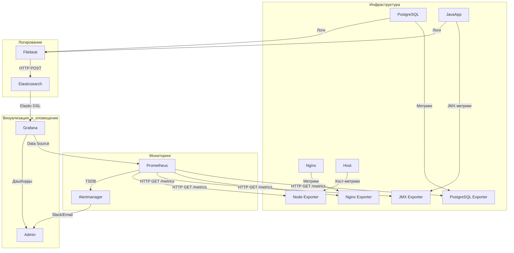

### 1. Введение в мониторинг
**Мониторинг** — это процесс непрерывного сбора, анализа и визуализации метрик ИТ-инфраструктуры и приложений для обеспечения их надежности, производительности и безопасности.  

**Цели мониторинга**:  
- Обнаружение аномалий и сбоев в реальном времени.  
- Прогнозирование нагрузки и масштабирование ресурсов.  
- Аудит соответствия SLA (Service Level Agreement).  
- Оптимизация использования ресурсов (CPU, RAM, disk I/O, network).  

---

### 1.1 Сравнение Prometheus/Mimir и Zabbix. Роль зонтичного мониторинга

| **Критерий**          | **Prometheus/Mimir + экспортеры**                    | **Zabbix + агенты**                                  |
|------------------------|------------------------------------------------------|-----------------------------------------------------|
| **Архитектура**        | Pull-based (метрики забираются по HTTP)             | Push/pull-based (агенты отправляют данные на сервер)|
| **Сбор данных**        | Экспортеры (Node Exporter, JMX Exporter, Postgres Exporter, Nginx Exporter) | Агенты (Zabbix Agent, SNMP)                         |
| **Масштабируемость**   | Горизонтальная (Mimir, Thanos)                       | Вертикальная (требует ресурсов на сервере)          |
| **Интеграции**         | PostgreSQL, Nginx, Kubernetes, ELK, Java-приложения  | Широкий спектр шаблонов для HW/SW                   |
| **Оповещения**         | Alertmanager (гибкие правила на PromQL)              | Встроенные триггеры и уведомления                   |
| **Типовые кейсы**      | Контейнеризированные среды, микросервисы, СУБД       | Enterprise-инфраструктура, legacy-системы           |

**Зонтичный мониторинг** — унификация данных из Prometheus/Mimir, ELK, Zabbix и PostgreSQL в единой системе (Grafana) для комплексного анализа.

---

### 2. Grafana: визуализация данных
**Grafana** — платформа для создания дашбордов и анализа метрик.  
**Пример для финтеха**:  
- Источник данных: Prometheus (метрики Java-приложения, PostgreSQL, Nginx) + Elasticsearch (логи транзакций).  
- Визуализация: График latency транзакций + тренды использования JVM Heap + статус репликации PostgreSQL.  

---

### 2.1 Prometheus/Mimir: сбор метрик
**Prometheus/Mimir** — TSDB для мониторинга динамических сред.  
**Зачем нужен**:  
- Забирает метрики через pull-метод (например, `/metrics` у PostgreSQL Exporter).  
- Использует PromQL для анализа (например, `rate(nginx_http_requests_total[5m])`).  
- **Mimir** — распределенная версия Prometheus для больших объемов данных.  

---

### 2.2 Экспортеры: Node Exporter, JMX Exporter, Postgres Exporter, Nginx Exporter
- **Node Exporter**: Собирает метрики хоста (CPU, RAM, диски).  
- **JMX Exporter**: Экспортирует метрики JVM (heap memory, GC pauses).  
- **Postgres Exporter**:  
  - Собирает метрики PostgreSQL:  
    ```bash
    # Пример конфигурации:
    DATA_SOURCE_NAME="user=postgres host=localhost port=5432" ./postgres_exporter
    ```
  - Метрики: `pg_stat_activity`, `pg_database_size`, репликация.  
- **Nginx Exporter**:  
  - Собирает метрики через `stub_status`:  
    ```nginx
    location /nginx_status {
        stub_status on;
        allow 127.0.0.1;
        deny all;
    }
    ```
  - Метрики: `nginx_http_requests_total`, `nginx_connections_active`.  

---

### 2.3 Flowchart TD: Grafana + Prometheus/Mimir + Экспортеры + Alertmanager


**Этапы**:  
1. **Сбор метрик**:  
   - **Postgres Exporter** публикует метрики БД (например, `pg_stat_user_tables`).  
   - **Nginx Exporter** предоставляет статус веб-сервера (активные соединения).  
   - **JMX Exporter** экспортирует метрики JVM (heap usage, threads).  
   - **Node Exporter** собирает данные хоста (CPU, RAM).  
2. **Агрегация**:  
   - Prometheus/Mimir забирает данные через HTTP GET (pull-метод) каждые 15 секунд.  
3. **Хранение**:  
   - Метрики сохраняются в TSDB Prometheus/Mimir.  
4. **Анализ**:  
   - Grafana запрашивает данные через PromQL (например, `avg(pg_database_size) by (datname)`).  
5. **Оповещение**:  
   - Alertmanager отправляет уведомления при превышении порогов (например, `pg_replication_lag > 30s`).  
6. **Логирование**:  
   - Filebeat отправляет логи PostgreSQL и Java-приложения в Elasticsearch.  
   - Grafana визуализирует логи через Kibana.  

---

### 3. Примеры PromQL для PostgreSQL и Nginx
**PostgreSQL**:  
- Мониторинг репликации:  
  ```promql
  max(pg_replication_lag) by (instance) > 30  # Лаг репликации > 30 секунд
  ```
- Загрузка БД:  
  ```promql
  sum by (datname) (rate(pg_stat_database_xact_commit[5m]))
  ```

**Nginx**:  
- Количество активных соединений:  
  ```promql
  max(nginx_connections_active) by (instance)
  ```
- Ошибки HTTP 5xx:  
  ```promql
  sum(rate(nginx_http_requests_total{status=~"5.."}[5m])) 
  ```

---

### 4. Завершение
**Итог**:  
- **Mimir** — оптимален для масштабных систем с PB данных.  
- **PostgreSQL/Nginx Exporters** расширяют мониторинг до СУБД и веб-серверов.  
- **Grafana** интегрирует все источники (Prometheus, ELK) в единую панель.  

**Рекомендации**:  
- Для PostgreSQL используйте алертинг на `pg_replication_lag` и `pg_database_size`.  
- Для Nginx настройте трекинг ошибок HTTP 5xx.  
- Включите **TLS** для защиты endpoints `/metrics` (например, в Nginx).


### 2.3 Flowchart TD: Grafana + Prometheus/Mimir + Экспортеры + Alertmanager

Ниже представлена улучшенная и более наглядная схема, где Prometheus активно забирает метрики из всех экспортеров (pull-метод), а Grafana использует Prometheus как единый источник данных (Data Source).



---

### **Этапы работы системы**

1. **Сбор метрик (Pull-метод)**:
   - **PostgreSQL Exporter**:  
     - PostgreSQL предоставляет метрики через `pg_stat_activity`, `pg_replication_lag` и другие.  
     - Prometheus забирает данные по HTTP GET `/metrics` (например, каждые 15 секунд).  
   - **Nginx Exporter**:  
     - Nginx предоставляет статус через модуль `stub_status`.  
     - Prometheus забирает данные по HTTP GET `/metrics` (например, `nginx_http_requests_total`).  
   - **JMX Exporter**:  
     - Java-приложение публикует JVM-метрики (heap memory, GC pauses) через `/metrics`.  
     - Prometheus забирает данные по HTTP GET `/metrics`.  
   - **Node Exporter**:  
     - Хост предоставляет метрики (CPU, RAM, диски, сетевые интерфейсы).  
     - Prometheus забирает данные по HTTP GET `/metrics`.

2. **Агрегация и хранение**:
   - Prometheus складывает все собранные метрики в TSDB (Time Series Database).  
   - Mimir может использоваться для распределенного хранения больших объемов данных.

3. **Анализ и визуализация**:
   - Grafana подключается к Prometheus как Data Source.  
   - Grafana выполняет запросы PromQL для анализа данных (например, `avg(pg_replication_lag)` или `rate(nginx_http_requests_total[5m])`).  
   - Результаты отображаются на дашбордах (например, тренды нагрузки на PostgreSQL, статус репликации, ошибки Nginx).

4. **Оповещение**:
   - Prometheus отправляет алерты в Alertmanager при срабатывании правил (например, лаг репликации > 30 секунд).  
   - Alertmanager отправляет уведомления администраторам через Slack, Email или PagerDuty.

5. **Логирование**:
   - Filebeat собирает логи PostgreSQL и Java-приложения.  
   - Логи индексируются в Elasticsearch.  
   - Grafana использует Elastic DSL для запроса логов и их визуализации через Kibana.

---

### **Примеры PromQL для анализа**
1. **PostgreSQL**:
   - Лаг репликации:
     ```promql
     max(pg_replication_lag) by (instance) > 30
     ```
   - Загрузка БД:
     ```promql
     sum by (datname) (rate(pg_stat_database_xact_commit[5m]))
     ```

2. **Nginx**:
   - Активные соединения:
     ```promql
     max(nginx_connections_active) by (instance)
     ```
   - Ошибки HTTP 5xx:
     ```promql
     sum(rate(nginx_http_requests_total{status=~"5.."}[5m]))
     ```

3. **Java-приложение**:
   - Использование heap memory:
     ```promql
     avg_over_time(jvm_memory_bytes_used{area="heap"}[1h])
     ```

4. **Инфраструктура**:
   - CPU загрузка:
     ```promql
     avg by (instance) (irate(node_cpu_seconds_total{mode="idle"}[1m]))
     ```

---

### **Итог**
- **Prometheus** активно забирает метрики из всех экспортеров (pull-метод).  
- **Grafana** использует Prometheus как единый Data Source для визуализации.  
- **ELK** дополняет мониторинг логами PostgreSQL и Java-приложений.  

**Рекомендации**:
- Настройте алертинг на ключевые метрики (например, `pg_replication_lag` или `nginx_http_errors`).  
- Используйте Mimir для масштабирования Prometheus в крупных системах.  
- Добавьте TLS для защиты endpoints `/metrics` (например, в Nginx).  

