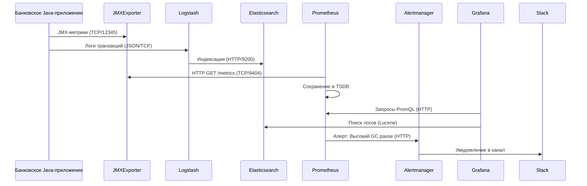
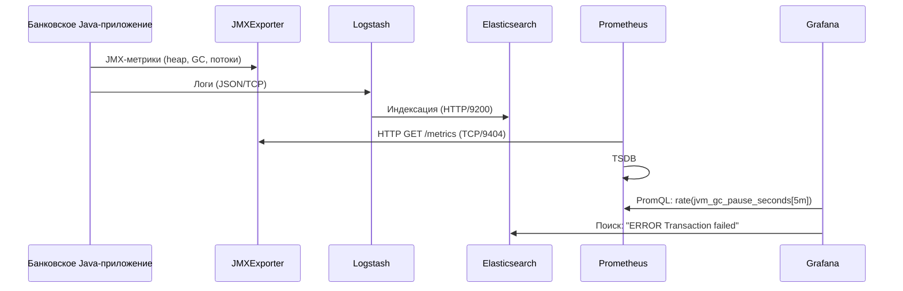
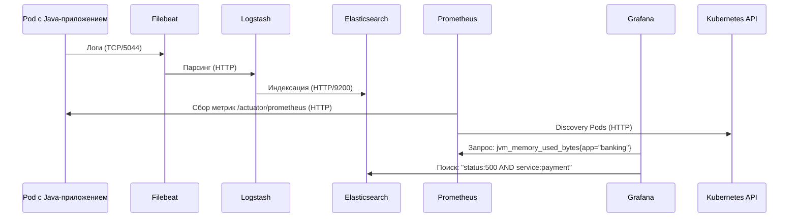
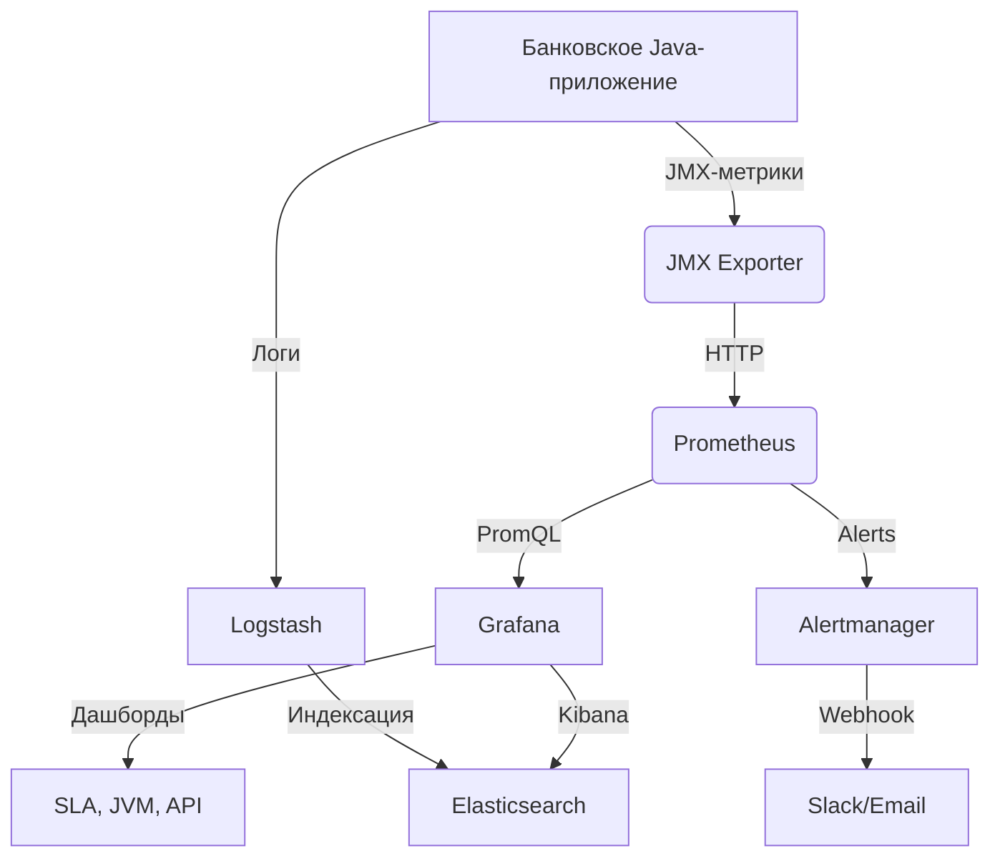
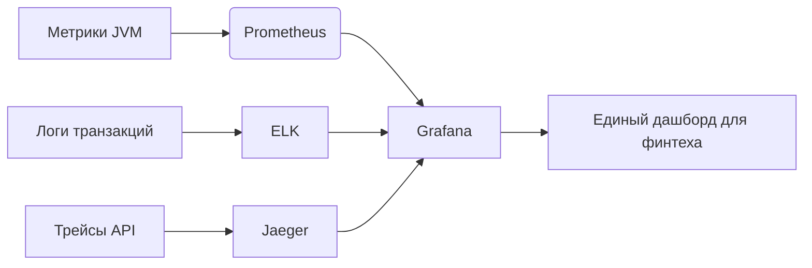

### 1. Введение в мониторинг  
**Мониторинг** — процесс непрерывного сбора, анализа и визуализации метрик, логов и состояний инфраструктуры, приложений и сервисов.  
**Цели**:  
- Обнаружение аномалий (сбои, деградация производительности).  
- Прогнозирование нагрузки и планирование ресурсов.  
- Обеспечение SLA/SLO (Service Level Agreements/Objectives).  
- Ускорение RCA (Root Cause Analysis).  

---

### 1.1 Сравнение Prometheus и Zabbix  

| **Критерий**          | **Prometheus**                          | **Zabbix**                              |  
|-----------------------|-----------------------------------------|-----------------------------------------|  
| **Архитектура**        | Pull-модель (сервер запрашивает метрики)| Push/Pull (агенты отправляют/сервер запрашивает)|  
| **Протоколы**          | HTTP(S)/PromQL                          | Zabbix-протокол, SNMP, HTTP, JMX        |  
| **Хранение данных**    | Временные ряды (TSDB)                   | Реляционная БД (MySQL, PostgreSQL)      |  
| **Масштабируемость**   | Горизонтальное (Thanos, Cortex)         | Вертикальное + прокси-серверы           |  
| **Обнаружение сервисов**| Динамическое (Kubernetes, Consul)       | Статическое + Zabbix Discovery          |  
| **Экспортеры/Агенты**  | Node Exporter, Blackbox Exporter        | Zabbix Agent, SNMP-агенты               |  
| **Зонтичный мониторинг**| Интеграция с Grafana, Alertmanager, ELK| Встроенные дашборды, триггеры           |  

**Зонтичный мониторинг** — объединение инструментов для комплексного покрытия (напр., Prometheus для метрик, ELK для логов, Jaeger для трейсов).  

---

### 2. Grafana  
**Grafana** — платформа визуализации и анализа метрик, логов и трейсов.  
**Пример**:  
- Подключение к Prometheus для отображения задержек API банковского Java-приложения.  
- Интеграция с Elasticsearch для анализа логов транзакций.  
- Создание дашбордов с алертами на отклонения от SLA.  

**Роль**:  
- Агрегация данных из разнородных источников (Prometheus, Elasticsearch, Jaeger).  
- Корреляция метрик (JVM-статус) и логов (стектрейсы ошибок).  

---

### 2.1 Prometheus  
**Prometheus** — TSDB (Time-Series Database) с pull-моделью сбора данных и языком запросов PromQL.  
**Цели**:  
- Мониторинг Java-приложений через JMX Exporter.  
- Автоматическое обнаружение микросервисов в Kubernetes.  
- Обработка метрик для алертинга (Alertmanager).  

**Оптимизация PromQL**:  
1. **Фильтрация метрик**: `jvm_memory_used_bytes{application="banking-app"}`.  
2. **Короткие интервалы для `rate()`**: `rate(jvm_gc_pause_seconds_count[2m])`.  
3. **Агрегация**: `sum by (instance) (http_server_requests_seconds_count{status!~"2.."})`.  

---

### 2.2 Экспортер  
**Экспортер** — промежуточный агент, преобразующий системные/прикладные метрики в формат, совместимый с Prometheus.  
**Пример: JMX Exporter для Java-приложения**:  
- Собирает метрики JVM (heap, GC, потоки).  
- Предоставляет их через HTTP-эндпоинт (`/metrics`) на порту 9404.  
- Prometheus парсит метрики для анализа производительности банковского API.  

---

### 2.3 Sequence Diagram: Grafana + Prometheus + Java-приложение + ELK  


---

### 3. Quadrant Chart: Инфраструктура с Java-приложением  
```mermaid  
quadrantChart  
    title Мониторинг банковского Java-приложения  
    x-axis Сложность реализации  
    y-axis Критичность  

    quadrant-1 Высокая критичность, низкая сложность: [JMX Exporter]  
    quadrant-2 Высокая критичность, высокая сложность: [Prometheus, ELK]  
    quadrant-3 Низкая критичность, низкая сложность: [Grafana]  
    quadrant-4 Низкая критичность, высокая сложность: [Кастомные алерты]  

    "Банковское Java-приложение": [x=0.2, y=0.9]  
    "JMX Exporter": [x=0.1, y=0.85]  
    "Prometheus": [x=0.7, y=0.8]  
    "ELK": [x=0.65, y=0.75]  
    "Alertmanager": [x=0.6, y=0.7]  
    "Grafana": [x=0.3, y=0.4]  
```  

**Процессы**:  
1. **Сбор метрик**: JMX Exporter преобразует метрики JVM в Prometheus-формат.  
2. **Логирование**: Транзакции и ошибки приложения отправляются в ELK через Logstash.  
3. **Анализ**: Grafana объединяет метрики (PromQL) и логи (Elasticsearch) для анализа SLA.  
4. **Алертинг**: Alertmanager уведомляет о проблемах (напр., нехватка heap памяти).  

---

### 4. Мониторинг в финтехе  
**Ключевые метрики для банковского приложения**:  
- **JVM**: `jvm_memory_used_bytes`, `jvm_gc_pause_seconds`.  
- **API**: `http_server_requests_seconds_count`, `http_server_errors_total`.  
- **Бизнес-метрики**: `transactions_processed_total`, `fraud_attempts_detected`.  

**ELK в финтехе**:  
- **Логи транзакций**: Поиск подозрительных операций через Kibana.  
- **Аудит безопасности**: Анализ доступа к критичным API.  
- **Корреляция**: При высокой частоте 5xx-ошибок (Prometheus) — поиск связанных логов (Elasticsearch).  

**Пример**:  
- Рост `jvm_gc_pause_seconds` → алерт в Slack → анализ логов на предмет утечек памяти.  

---

### 5. Sequence Diagram: Java-приложение в ВМ + ELK  


---

### 6. Sequence Diagram: Java-приложение в Kubernetes + ELK  


---

### 7. Итог  
**Архитектура мониторинга для банковского Java-приложения**:  
1. **Метрики**:  
   - **Prometheus**: Сбор JVM-метрик через JMX Exporter.  
   - **Оптимизация**: Использование Recording Rules для предрасчета SLA.  
2. **Логи**:  
   - **ELK**: Централизованный сбор и анализ транзакций.  
   - **Интеграция**: Grafana отображает метрики и логи в едином дашборде.  
3. **Алертинг**:  
   - **Alertmanager**: Уведомления о проблемах JVM/API через Slack/Email.  
4. **Kubernetes**:  
   - Автоматическое обнаружение Pods через ServiceMonitors.  
   - Масштабируемость с использованием Thanos для долгосрочного хранения.  

**Финальная схема**:  


**Заключение**:  
Для банковских Java-приложений критично объединение **метрик** (Prometheus), **логов** (ELK) и **алертинга** (Alertmanager) в единую платформу наблюдаемости.  
- **Оптимизация PromQL** снижает нагрузку на TSDB и ускоряет анализ.  
- **ELK** обеспечивает глубокий анализ транзакций и аудит безопасности.  
- **Kubernetes** автоматизирует мониторинг в масштабируемых средах.  

**Рекомендации**:  
- Внедрите **Loki** для логов с метками в стиле Prometheus.  
- Добавьте **Jaeger** для трейсинга latency между микросервисами.  
- Используйте **Infrastructure as Code** (Terraform, Helm) для воспроизводимости конфигураций.  



Такой стек гарантирует прозрачность, надежность и соответствие регуляторным требованиям в высоконагруженных финансовых системах.
