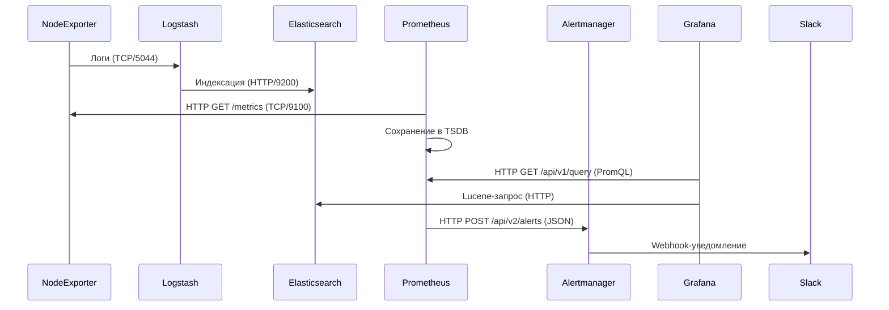
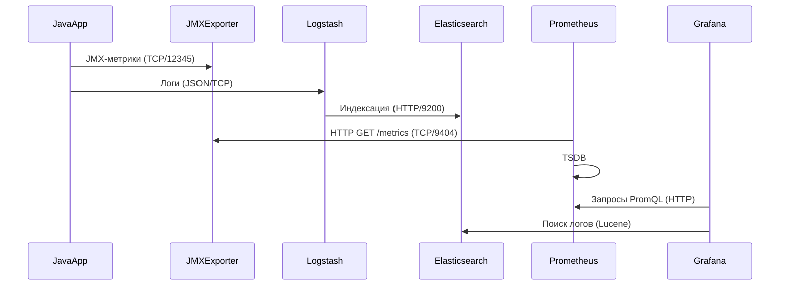
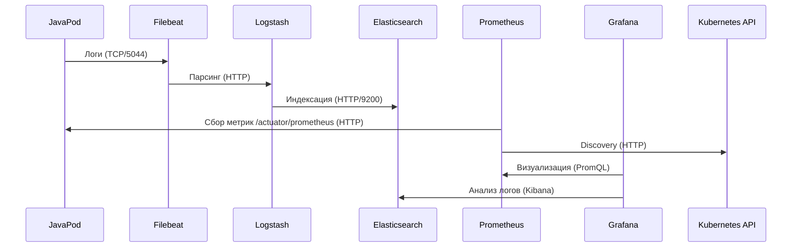
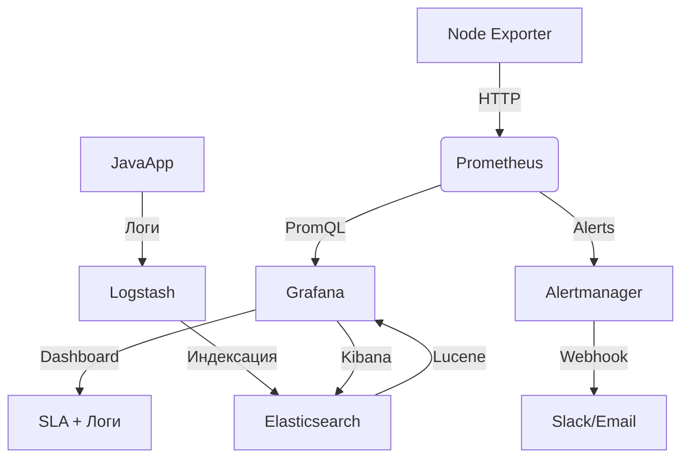

### 1. Введение в мониторинг  
**Мониторинг** — процесс непрерывного сбора, анализа и визуализации метрик, логов и состояний инфраструктуры, приложений и сервисов.  
**Цели**:  
- Обнаружение аномалий (сбои, деградация производительности).  
- Прогнозирование нагрузки и планирование ресурсов.  
- Обеспечение SLA/SLO (Service Level Agreements/Objectives).  
- Ускорение RCA (Root Cause Analysis).  

---

### 1.1 Сравнение Prometheus и Zabbix  

| **Критерий**          | **Prometheus**                          | **Zabbix**                              |  
|-----------------------|-----------------------------------------|-----------------------------------------|  
| **Архитектура**        | Pull-модель (сервер запрашивает метрики)| Push/Pull (агенты отправляют/сервер запрашивает)|  
| **Протоколы**          | HTTP(S)/PromQL                          | Zabbix-протокол, SNMP, HTTP, JMX        |  
| **Хранение данных**    | Временные ряды (TSDB)                   | Реляционная БД (MySQL, PostgreSQL)      |  
| **Масштабируемость**   | Горизонтальное (Thanos, Cortex)         | Вертикальное + прокси-серверы           |  
| **Обнаружение сервисов**| Динамическое (Kubernetes, Consul)       | Статическое + Zabbix Discovery          |  
| **Экспортеры/Агенты**  | Node Exporter, Blackbox Exporter        | Zabbix Agent, SNMP-агенты               |  
| **Зонтичный мониторинг**| Интеграция с Grafana, Alertmanager, ELK| Встроенные дашборды, триггеры           |  

**Зонтичный мониторинг** — объединение инструментов для комплексного покрытия (напр., Prometheus для метрик, ELK для логов, Jaeger для трейсов).  

---

### 2. Grafana  
**Grafana** — платформа визуализации и анализа метрик, логов и трейсов.  
**Пример**:  
- Подключение к Prometheus для отображения CPU-нагрузки серверов.  
- Интеграция с Elasticsearch для поиска логов транзакций.  
- Создание дашбордов с графиками, heatmap-ами и алертами.  

**Роль**:  
- Агрегация данных из разнородных источников (Prometheus, Loki, Elasticsearch).  
- Интерактивное исследование метрик через GUI.  

---

### 2.1 Prometheus  
**Prometheus** — TSDB (Time-Series Database) с pull-моделью сбора данных и языком запросов PromQL.  
**Цели**:  
- Мониторинг состояния сервисов через HTTP-эндпоинты.  
- Автоматическое обнаружение целей (Kubernetes, Consul).  
- Обработка метрик для алертинга (Alertmanager).  

**Оптимизация PromQL**:  
1. **Фильтрация метрик**: `{__name__!~"unwanted_metric"}`.  
2. **Короткие интервалы для `rate()`**: `rate(http_requests_total[5m])`.  
3. **Агрегация**: `sum by (instance) (cpu_usage)`.  
4. **Recording Rules**: Предрасчет сложных запросов.  

---

### 2.2 Экспортер  
**Экспортер** — промежуточный агент, преобразующий системные/прикладные метрики в формат, совместимый с Prometheus.  
**Пример: Node Exporter**  
- Собирает метрики ОС (CPU, RAM, диск, сеть).  
- Предоставляет их через HTTP-эндпоинт (`/metrics`) на порту 9100.  
- Prometheus парсит их по расписанию (напр., каждые 15 сек).  

---

### 2.3 Sequence Diagram: Grafana + Prometheus + Node Exporter + Alertmanager + ELK  


---

### 3. Quadrant Chart: Инфраструктура из 10 ВМ с ELK  
```mermaid  
quadrantChart  
    title Мониторинг 10 ВМ через Node Exporter и ELK  
    x-axis Сложность реализации  
    y-axis Критичность  

    quadrant-1 Высокая критичность, низкая сложность: [Node Exporter]  
    quadrant-2 Высокая критичность, высокая сложность: [Prometheus, ELK]  
    quadrant-3 Низкая критичность, низкая сложность: [Grafana Dashboards]  
    quadrant-4 Низкая критичность, высокая сложность: [Кастомные алерты]  

    "Node Exporter (10 ВМ)": [x=0.1, y=0.9]  
    "Prometheus": [x=0.7, y=0.8]  
    "ELK": [x=0.65, y=0.75]  
    "Alertmanager": [x=0.6, y=0.7]  
    "Grafana": [x=0.3, y=0.4]  
```  

**Процессы**:  
1. **Сбор данных**: Node Exporter на каждой ВМ предоставляет метрики через HTTP.  
2. **Логи**: Logstash парсит и отправляет логи в Elasticsearch.  
3. **Получение метрик**: Prometheus опрашивает `/metrics` всех ВМ.  
4. **Хранение**: TSDB Prometheus + Elasticsearch для логов.  
5. **Визуализация**: Grafana объединяет метрики (PromQL) и логи (Lucene).  
6. **Алертинг**: Alertmanager отправляет уведомления при превышении порогов.  

---

### 4. Мониторинг в финтехе  
**Метрики**:  
- **Инфраструктура**: CPU, RAM, сеть (пропускная способность, задержки).  
- **Приложения**: Время обработки транзакций, ошибки JVM (Java).  
- **Бизнес-логика**: Количество операций, фрод-события.  

**ELK в финтехе**:  
- **Логи транзакций**: Поиск аномалий через Elasticsearch.  
- **Аудит безопасности**: Анализ подозрительных активностей.  
- **Корреляция данных**: Grafana отображает метрики (Prometheus) и логи (Kibana) в едином дашборде.  

**Пример**:  
- Prometheus отслеживает задержки API платежного шлюза.  
- При ошибке JVM Grafana показывает связанный стектрейс из Elasticsearch.  

---

### 5. Sequence Diagram: Java-приложение в ВМ + ELK  


---

### 6. Sequence Diagram: Java-приложение в Kubernetes + ELK  


---

### 7. Итог  
**Современный стек мониторинга**:  
1. **Метрики**:  
   - Prometheus с оптимизацией запросов (PromQL).  
   - Экспортеры (Node Exporter, JMX Exporter).  
2. **Логи**:  
   - ELK (Elasticsearch, Logstash, Kibana) для сбора и анализа.  
   - Интеграция с Grafana для единого интерфейса.  
3. **Алертинг**:  
   - Alertmanager с уведомлениями в Slack/Email.  
4. **Наблюдаемость**:  
   - Grafana как центральный хаб для метрик, логов и трейсов.  

**Ключевые улучшения**:  
- **Оптимизация PromQL**: Снижение нагрузки на TSDB через фильтрацию и предрасчеты.  
- **Глубокая корреляция**: Совместное использование Prometheus (метрики) и ELK (логи) в Grafana.  
- **Масштабируемость**: Гибкое развертывание в Kubernetes с Filebeat и ServiceMonitors.  

**Финальная архитектура**:  


**Заключение**:  
Интеграция Prometheus, Grafana и ELK формирует полноценную **платформу наблюдаемости**, критичную для высоконагруженных систем (финтех, банкинг).  
- **Метрики** выявляют аномалии в реальном времени.  
- **Логи** ускоряют RCA через поиск в Elasticsearch.  
- **Оптимизация PromQL** снижает нагрузку и повышает отзывчивость.  
- **Kubernetes** обеспечивает масштабируемость и автоматизацию.  

**Рекомендации**:  
- Внедряйте **Loki** для логов с метками в стиле Prometheus.  
- Добавьте **Jaeger/Zipkin** для трейсинга микросервисов.  
- Используйте **Infrastructure as Code** (Terraform, Ansible) для управления конфигурацией.
