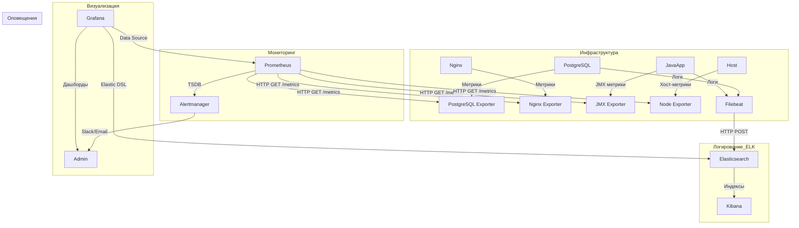

### 1. Введение в мониторинг
**Мониторинг** — это процесс непрерывного сбора, анализа и визуализации метрик ИТ-инфраструктуры и приложений для обеспечения их надежности, производительности и безопасности.  

**Цели мониторинга**:  
- Обнаружение аномалий и сбоев в реальном времени.  
- Прогнозирование нагрузки и масштабирование ресурсов.  
- Аудит соответствия SLA (Service Level Agreement).  
- Оптимизация использования ресурсов (CPU, RAM, disk I/O, network).  

---

### 1.1 Сравнение Prometheus/Mimir и Zabbix. Роль зонтичного мониторинга

| **Критерий**          | **Prometheus/Mimir + экспортеры**                    | **Zabbix + агенты**                                  |
|------------------------|------------------------------------------------------|-----------------------------------------------------|
| **Архитектура**        | Pull-based (метрики забираются по HTTP)             | Push/pull-based (агенты отправляют данные на сервер)|
| **Сбор данных**        | Экспортеры (Node Exporter, JMX Exporter, Postgres Exporter, Nginx Exporter) | Агенты (Zabbix Agent, SNMP)                         |
| **Масштабируемость**   | Горизонтальная (Mimir, Thanos)                       | Вертикальная (требует ресурсов на сервере)          |
| **Интеграции**         | PostgreSQL, Nginx, Kubernetes, ELK, Java-приложения  | Широкий спектр шаблонов для HW/SW                   |
| **Оповещения**         | Alertmanager (гибкие правила на PromQL)              | Встроенные триггеры и уведомления                   |
| **Типовые кейсы**      | Контейнеризированные среды, микросервисы, СУБД       | Enterprise-инфраструктура, legacy-системы           |

**Зонтичный мониторинг** — унификация данных из Prometheus/Mimir, ELK, Zabbix и PostgreSQL в единой системе (Grafana) для комплексного анализа.

---

### 2. Grafana: визуализация данных
**Grafana** — платформа для создания дашбордов и анализа метрик.  
**Пример для финтеха**:  
- Источник данных: Prometheus (метрики Java-приложения, PostgreSQL, Nginx) + Elasticsearch (логи транзакций).  
- Визуализация: График latency транзакций + тренды использования JVM Heap + статус репликации PostgreSQL.  

---

### 2.1 Prometheus/Mimir: сбор метрик
**Prometheus/Mimir** — TSDB для мониторинга динамических сред.  
**Зачем нужен**:  
- Забирает метрики через pull-метод (например, `/metrics` у PostgreSQL Exporter).  
- Использует PromQL для анализа (например, `rate(nginx_http_requests_total[5m])`).  
- **Mimir** — распределенная версия Prometheus для больших объемов данных.  

---

### 2.2 Экспортеры: Node Exporter, JMX Exporter, Postgres Exporter, Nginx Exporter
- **Node Exporter**: Собирает метрики хоста (CPU, RAM, диски).  
- **JMX Exporter**: Экспортирует метрики JVM (heap memory, GC pauses).  
- **Postgres Exporter**:  
  - Собирает метрики PostgreSQL:  
    ```bash
    # Пример конфигурации:
    DATA_SOURCE_NAME="user=postgres host=localhost port=5432" ./postgres_exporter
    ```
  - Метрики: `pg_stat_activity`, `pg_database_size`, репликация.  
- **Nginx Exporter**:  
  - Собирает метрики через `stub_status`:  
    ```nginx
    location /nginx_status {
        stub_status on;
        allow 127.0.0.1;
        deny all;
    }
    ```
  - Метрики: `nginx_http_requests_total`, `nginx_connections_active`.  

---

### 1. Flowchart TD: Взаимодействие Prometheus с экспортерами и ELK

Ниже представлена улучшенная схема, включающая интеграцию **ELK** (Elasticsearch, Logstash, Kibana) для сбора и анализа логов, а также взаимодействие **Prometheus** с экспортерами.



---

### **Описание схемы**

1. **Сбор метрик (Pull-метод)**:
   - **PostgreSQL Exporter**:  
     - PostgreSQL предоставляет метрики через `pg_stat_activity`, `pg_replication_lag` и другие.  
     - Prometheus забирает данные по HTTP GET `/metrics`.  
   - **Nginx Exporter**:  
     - Nginx предоставляет статус через модуль `stub_status`.  
     - Prometheus забирает данные по HTTP GET `/metrics`.  
   - **JMX Exporter**:  
     - Java-приложение публикует JVM-метрики (heap memory, GC pauses) через `/metrics`.  
     - Prometheus забирает данные по HTTP GET `/metrics`.  
   - **Node Exporter**:  
     - Хост предоставляет метрики (CPU, RAM, диски, сетевые интерфейсы).  
     - Prometheus забирает данные по HTTP GET `/metrics`.

2. **Сбор логов (ELK)**:
   - **Filebeat**:  
     - Собирает логи PostgreSQL и Java-приложения.  
     - Отправляет логи в Elasticsearch через HTTP POST.  
   - **Elasticsearch**:  
     - Индексирует логи для последующего анализа.  
   - **Kibana**:  
     - Предоставляет визуализацию логов через Elastic DSL.

3. **Агрегация и хранение**:
   - Prometheus складывает все собранные метрики в TSDB (Time Series Database).  
   - Mimir может использоваться для распределенного хранения больших объемов данных.

4. **Анализ и визуализация**:
   - Grafana подключается к Prometheus как Data Source для анализа метрик.  
   - Grafana также подключается к Elasticsearch для анализа логов.  
   - Результаты отображаются на дашбордах (например, тренды нагрузки на PostgreSQL, статус репликации, ошибки Nginx).

5. **Оповещение**:
   - Prometheus отправляет алерты в Alertmanager при срабатывании правил (например, лаг репликации > 30 секунд).  
   - Alertmanager отправляет уведомления администраторам через Slack, Email или PagerDuty.

---

### **Примеры использования ELK**
1. **Анализ логов PostgreSQL**:
   - Поиск ошибок репликации:
     ```json
     {
       "query": {
         "match": {
           "message": "replication lag"
         }
       }
     }
     ```

2. **Анализ логов Java-приложения**:
   - Поиск исключений:
     ```json
     {
       "query": {
         "match": {
           "level": "ERROR"
         }
       }
     }
     ```

---

### **Итог**
- **Prometheus** активно забирает метрики из всех экспортеров (pull-метод).  
- **ELK** дополняет мониторинг логами PostgreSQL и Java-приложений.  
- **Grafana** объединяет метрики и логи в единой панели для анализа.  

**Рекомендации**:
- Настройте Filebeat для сбора логов с минимальной задержкой.  
- Используйте Kibana для создания дашбордов логов.  
- Добавьте TLS для защиты endpoints `/metrics` и логов.  


