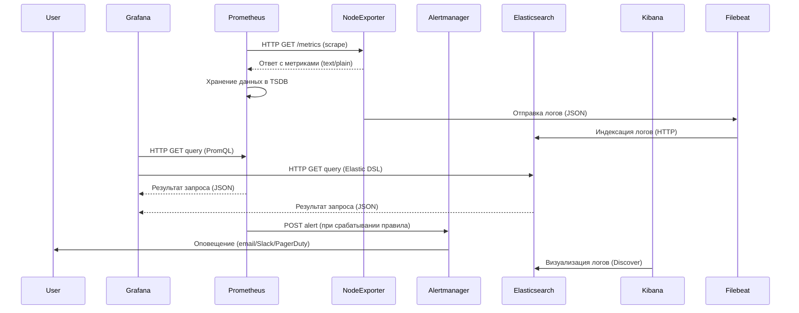
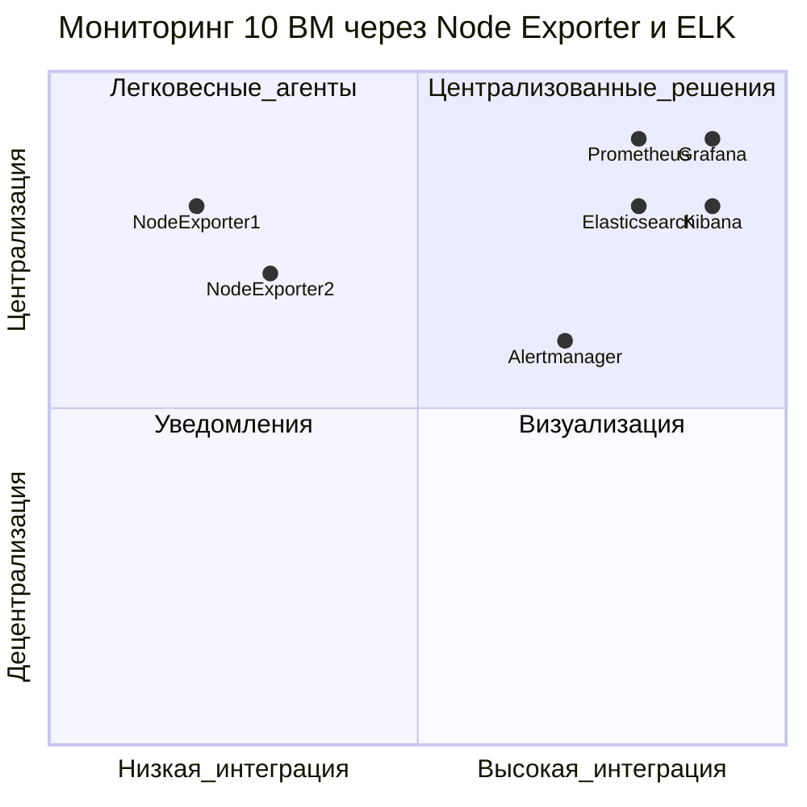
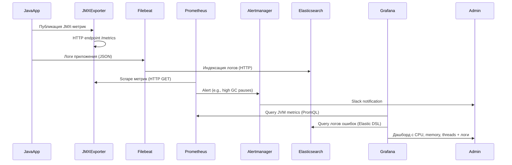
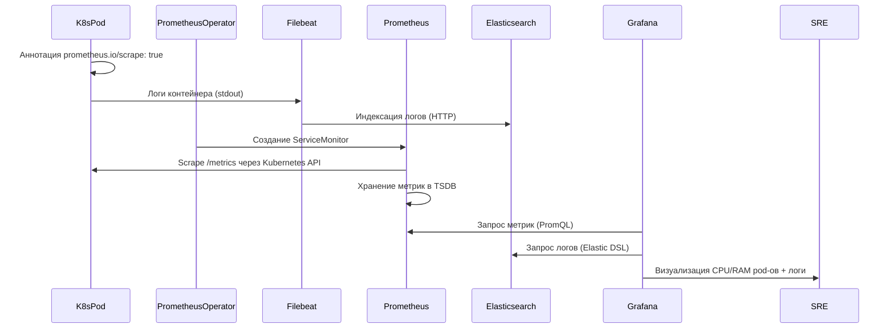

### 1. Введение в мониторинг
Мониторинг — это процесс непрерывного сбора, анализа и визуализации метрик ИТ-инфраструктуры и приложений для обеспечения их надежности, производительности и безопасности.  
**Цели мониторинга**:  
- Обнаружение аномалий и сбоев в реальном времени.  
- Прогнозирование нагрузки и масштабирование ресурсов.  
- Аудит соответствия SLA (Service Level Agreement).  
- Оптимизация использования ресурсов (CPU, RAM, disk I/O, network).  

---

### 1.1 Сравнение Prometheus и Zabbix. Роль зонтичного мониторинга

| **Критерий**          | **Prometheus + экспортеры**                          | **Zabbix + агенты**                                  |
|------------------------|------------------------------------------------------|-----------------------------------------------------|
| **Архитектура**        | Pull-based (метрики забираются по HTTP)             | Push/pull-based (агенты отправляют данные на сервер)|
| **Сбор данных**        | Экспортеры (например, Node Exporter, Blackbox)       | Агенты (Zabbix Agent, SNMP)                         |
| **Масштабируемость**   | Горизонтальная (через federation и Thanos)           | Вертикальная (требует ресурсов на сервере)          |
| **Интеграции**         | Нативная поддержка Kubernetes, ELK (через Exporters) | Широкий спектр шаблонов для HW/SW                   |
| **Оповещения**         | Alertmanager (гибкие правила на PromQL)              | Встроенные триггеры и уведомления                   |
| **Типовые кейсы**      | Контейнеризированные среды, микросервисы             | Enterprise-инфраструктура, legacy-системы           |

**Зонтичный мониторинг** — унификация данных из Prometheus, ELK и Zabbix в единой системе (например, Grafana) для комплексного анализа.

---

### 2. Grafana: визуализация данных
**Grafana** — платформа для создания дашбордов и анализа метрик.  
**Пример**:  
- Источник данных: Prometheus (CPU usage) + Elasticsearch (логи).  
- Визуализация: График загрузки CPU с алертингом при превышении 90% + логи ошибок из Kibana.  
**Роль**:  
- Агрегация данных из Prometheus, ELK, Zabbix.  
- Настройка оповещений через Alerting Engine.  

---

### 2.1 Prometheus: сбор метрик
**Prometheus** — TSDB (Time Series Database) для мониторинга динамических сред.  
**Зачем нужен**:  
- Забирает метрики по HTTP (pull-метод).  
- Использует PromQL для сложных запросов (оптимизация через `rate()`, `avg_over_time()`).  
- Интегрируется с ELK через экспортеры (например, `prometheus-elasticsearch-exporter`).  

---

### 2.2 Экспортеры: Node Exporter
**Экспортер** — сервис, предоставляющий метрики в формате, понятном Prometheus.  
**Node Exporter**:  
- Собирает данные о CPU, RAM, дисках, сетевых интерфейсах.  
- Запускается на каждом узле и предоставляет `/metrics` по HTTP.  
- Логи Node Exporter могут экспортироваться в ELK через Filebeat.  

---

### 2.3 Mermaid Sequence Diagram (с ELK)


---

### 3. Mermaid Quadrant Chart (с ELK)


**Процессы**:  
1. **Node Exporters** публикуют метрики на порту 9100 и логи через Filebeat.  
2. **Prometheus** скребет данные по HTTP каждые 15 секунд.  
3. **Elasticsearch** индексирует логи из Filebeat.  
4. **Alertmanager** получает алерты при превышении пороговых значений.  
5. **Grafana** визуализирует метрики и логи через дашборды.  

---

### 4. Оптимизация PromQL
**Методы**:  
- Использование `rate()` для контроля скорости (например, `rate(http_requests_total[5m])`).  
- Агрегация данных: `sum by (instance) (process_cpu_seconds_total)`.  
- Подзапросы: `max_over_time(cpu_usage{env="prod"}[1h:])`.  
- Оптимизация регулярных выражений: `http_requests_total{method!~"GET|POST"}`.  

**Пример для финтеха**:  
```promql
# Обнаружение высокой latency транзакций
histogram_quantile(0.99, sum by (le) (rate(transaction_duration_seconds_bucket[5m])))
```

---

### 5. Sequence Diagram: Java-приложение в ВМ (с ELK)


---

### 6. Sequence Diagram: Java-приложение в Kubernetes (с ELK)


---

### 7. Завершение
**Итог**:  
- **Prometheus + Grafana + ELK** = стандарт для мониторинга и анализа логов в финтехе.  
- **Оптимизация PromQL** снижает нагрузку на TSDB и ускоряет алертинг.  
- **ELK** критичен для анализа транзакций и обнаружения фрода через логи.  
- **Рекомендация**: Используйте `rate()` и агрегации в PromQL, а для логов — Filebeat + Elasticsearch.  
