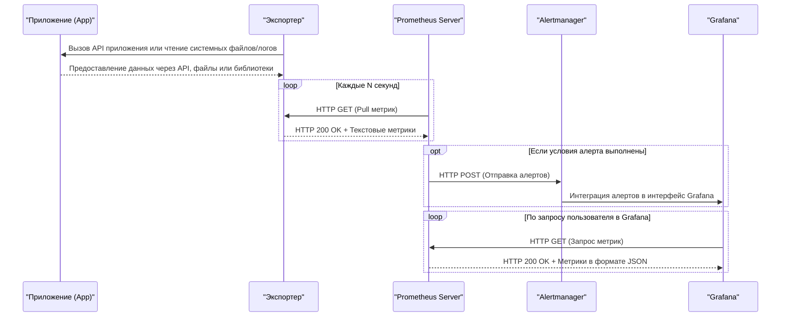

# Alerting
**Alertmanager** — это компонент Prometheus, предназначенный для управления алертами. Он принимает алерты от Prometheus, группирует их, подавляет ненужные уведомления и доставляет их в различные системы оповещения.
## Расширенная схема: Alertmanager + Grafana

**Описание:**  
- Prometheus собирает метрики и проверяет условия алертов.
- Если условия выполнены, Prometheus отправляет алерты в Alertmanager.
- Alertmanager может интегрироваться с Grafana для отображения алертов.
- Grafana запрашивает метрики у Prometheus для визуализации.

---
