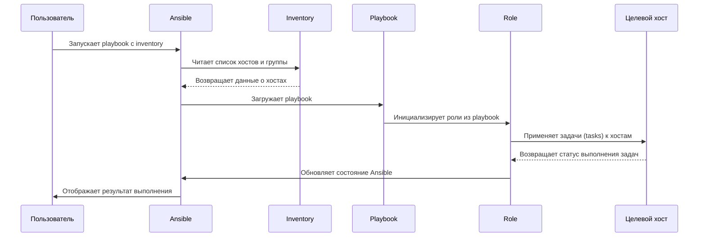

### **Объяснение схемы:**
1. **Пользователь** запускает playbook с указанием inventory:
   ```bash
   ansible-playbook -i inventory.ini playbook.yml
   ```

2. **Ansible** читает **inventory**, чтобы определить:
   - Какие хосты будут обрабатываться.
   - Переменные, связанные с хостами/группами.

3. **Playbook**:
   - Определяет, какие роли (roles) нужно применить.
   - Загружает структуру задач (tasks), переменные и обработчики (handlers).

4. **Role**:
   - Выполняет задачи (tasks) из своей структуры.
   - Использует шаблоны (templates) и переменные (vars).
   - Обновляет состояние сервисов через обработчики (handlers).

5. **Целевой хост**:
   - Принимает команды Ansible через SSH/WinRM.
   - Выполняет задачи локально (например, устанавливает ПО, изменяет файлы).

6. **Результат**:
   - Ansible возвращает отчёт о выполнении задач.
   - Пользователь видит статус (успешно/ошибки).

---

### **Дополнительные элементы в реальных сценариях:**
- **Переменные** (vars): Используются в playbook и ролях для настройки задач.
- **Обработчики** (handlers): Перезапускают сервисы после изменений (например, после обновления конфига).
- **Модули** (modules): Выполняют конкретные действия (apt, file, service).
- **Шаблоны** (templates): Генерируют конфигурационные файлы через Jinja2.
