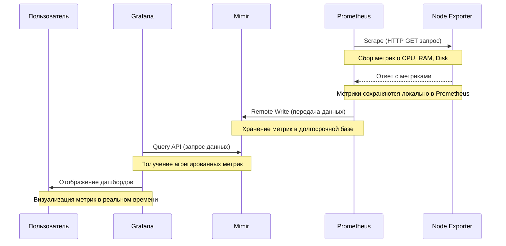

# Mimir

## Введение

Современные системы мониторинга позволяют отслеживать состояние инфраструктуры, выявлять проблемы и обеспечивать стабильность работы сервисов. Одной из популярных архитектур для мониторинга является комбинация **Node Exporter**, **Prometheus**, **Mimir** и **Grafana**. Эта схема позволяет собирать метрики с серверов, хранить их в долгосрочном хранилище и визуализировать данные для анализа.

В данной статье мы рассмотрим последовательность шагов взаимодействия между компонентами этой архитектуры. Схема будет представлена в виде **Диаграммы (sequence diagram)**, которая наглядно покажет, как данные передаются между участниками процесса.

### Основные особенности Mimir:
1. **Горизонтальная масштабируемость**: Mimir может обрабатывать огромные объемы данных, распределяя нагрузку между множеством узлов.
2. **Долгосрочное хранение**: Позволяет хранить метрики в течение длительного времени, что полезно для анализа исторических данных.
3. **Мультитенантность**: Поддерживает работу с несколькими независимыми пользователями или командами (тенантами) в рамках одного кластера.
4. **Совместимость с Prometheus**: Mimir полностью совместим с API Prometheus, что позволяет легко интегрировать его в существующие системы мониторинга.
5. **Эффективное сжатие данных**: Использует современные алгоритмы сжатия для уменьшения объема хранимых данных.

### Как работает Mimir?
Mimir принимает метрики от Prometheus (или других источников), хранит их в распределенной системе и предоставляет доступ к данным через API, совместимый с Prometheus. Это позволяет использовать Mimir как замену или дополнение к локальному хранилищу Prometheus, особенно в случаях, когда требуется долгосрочное хранение или высокая доступность данных.

### Пример использования:
- Вы используете Prometheus для сбора метрик в Kubernetes-кластере.
- Данные отправляются в Mimir для долгосрочного хранения и анализа.
- Grafana подключается к Mimir для визуализации метрик.

---

### Полная последовательность шагов взаимодействия между компонентами этой архитектуры

1. **Prometheus опрашивает Node Exporter**:
   - Prometheus активно "ходит" в Node Exporter через HTTP GET запрос (`Scrape`).
   - Node Exporter предоставляет метрики о состоянии сервера (например, использование CPU, памяти, дискового пространства).
   - Prometheus сохраняет эти метрики локально для временного хранения.

2. **Node Exporter возвращает метрики**:
   - Node Exporter отвечает на запрос Prometheus, отправляя данные в формате, понятном для Prometheus (обычно это текстовый формат метрик).
   - Эти данные содержат информацию о текущем состоянии сервера.

3. **Prometheus отправляет данные в Mimir**:
   - После сбора метрик Prometheus отправляет их в долгосрочное хранилище Mimir через механизм `Remote Write`.
   - Mimir принимает данные и сохраняет их для дальнейшего использования.

4. **Grafana запрашивает данные из Mimir**:
   - Grafana, используя `Query API`, запрашивает данные из Mimir.
   - Mimir предоставляет агрегированные метрики, которые могут быть использованы для построения графиков.

5. **Grafana отображает данные пользователю**:
   - Grafana обрабатывает полученные данные и строит дашборды с графиками, таблицами и другими визуальными элементами.
   - Пользователь видит эти дашборды через веб-интерфейс Grafana и может анализировать состояние системы.

---

### Диаграмма

---

### Заключение

Данная схема демонстрирует, как компоненты системы мониторинга взаимодействуют друг с другом для сбора, хранения и визуализации данных. Каждый шаг четко показывает роль каждого участника:

- **Node Exporter**: Собирает метрики с серверов.
- **Prometheus**: Активно забирает метрики и отправляет их в долгосрочное хранилище.
- **Mimir**: Обеспечивает надежное хранение данных.
- **Grafana**: Предоставляет удобный интерфейс для анализа данных.
