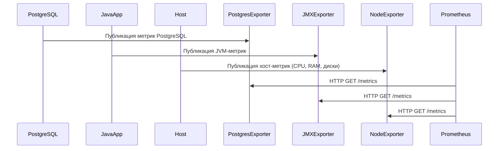

# **Сбор метрик**

Сбор метрик — это первый и один из самых важных этапов мониторинга. Он позволяет получить количественные данные о состоянии системы, таких как загрузка процессора, использование памяти, количество запросов к базе данных и многое другое. Рассмотрим этот процесс подробнее:

### **Схема сбора метрик**



- **PostgreSQL**, **JavaApp** и **Host**:
  - Эти компоненты генерируют метрики, которые отражают их текущее состояние.
  - Например:
    - **PostgreSQL** предоставляет метрики о производительности базы данных: время выполнения запросов, размер базы данных, статус репликации.
    - **JavaApp** публикует JVM-метрики: использование памяти (heap/non-heap), частота сборки мусора (GC), количество активных потоков.
    - **Host** предоставляет информацию о физическом или виртуальном сервере: загрузка CPU, использование RAM, скорость чтения/записи дисков, сетевой трафик.

- **Экспортеры**:
  - Для того чтобы данные стали доступными для Prometheus, используются специальные экспортеры:
    - **PostgresExporter**: Экспортирует метрики PostgreSQL через HTTP-эндпоинт `/metrics`. Пример метрик:
      ```plaintext
      pg_stat_activity_count{state="active"} 50
      pg_database_size_bytes{datname="mydb"} 1073741824
      ```
    - **JMXExporter**: Собирает метрики JVM через JMX (Java Management Extensions). Пример метрик:
      ```plaintext
      jvm_memory_bytes_used{area="heap"} 536870912
      jvm_gc_pause_seconds_sum 12.345
      ```
    - **NodeExporter**: Собирает метрики хоста (CPU, RAM, диски, сеть). Пример метрик:
      ```plaintext
      node_cpu_seconds_total{mode="idle"} 123456.78
      node_memory_MemAvailable_bytes 2147483648
      ```

- **Prometheus**:
  - Prometheus забирает метрики через HTTP GET `/metrics` (pull-метод). Это означает, что Prometheus периодически запрашивает данные у экспортеров.
  - Преимущества pull-модели:
    - Централизованный контроль: Prometheus управляет всем процессом сбора данных.
    - Удобство настройки: можно легко добавить новые экспортеры без изменения конфигурации на стороне источников.
    - Надежность: если источник недоступен, Prometheus может повторить попытку или отправить алерт.
