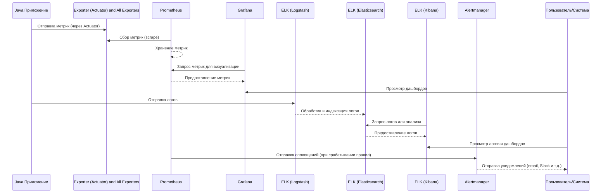

# **Pet-проекты в качестве примеров (берем в работу только финтех тематику)**

Каждое приложение будет настроено для мониторинга метрик и логов через **Prometheus, [ELK Stack](https://habr.com/ru/articles/671344/)** и **[Actuator](https://habr.com/ru/companies/otus/articles/452624/)**.
- Берем в работу **Figma** и рисуем красивую блочную схему проекта [в таком же стиле](https://miro.com/app/board/uXjVIMhc1ds=/). 
- Образец схемы интегрированной в GitHub ([диаграммы](https://mermaid.live/edit#pako:eNpVjkFvgzAMhf9K5NMmQUVX2kAOk1bYeqm0Seup0IMFKUEtCQpBXQf89wW6TZtPtt_3nt1BpnIODI5ndckEakN2cSqJrackErpsTIXNgbjuY7_hhlRK8mtP1ncbRRqh6rqUxf2NX48QibrtiHFiRClPw02KJv-r5D2Jky3WRtWHv8ruonrynJRvwsb_V4Tm1vWSHJEd0c1Qkwj1hIADFdcVlrl9vxs3KRjBK54Cs22O-pRCKgfLYWvU-1VmwIxuuQNatYUAG3hu7NTWORoel1horH6QGuVeqd-x0OOZbzeXOdeRaqUBtpxQYB18AJvT-cyjIfWDYP4QLla-A1eLBDPqh-EqpAt_RQPP8wcHPqdwbxbQ5fAFMeJ4rA)) для всех примеров одинаковый (mermaid: [sequenceDiagram](https://mermaid.js.org/syntax/sequenceDiagram.html)):



## **Последовательность работы системы мониторинга на основе диаграммы:**

### **1. Сбор и визуализация метрик (Prometheus + Grafana)**
1. **Java-приложение** отправляет метрики через **Spring Boot Actuator** (Endpoint `/actuator/prometheus`).
2. **Prometheus** периодически собирает (scrape) эти метрики из **Exporter** (Actuator).
3. **Prometheus** хранит метрики в своей TSDB (Time Series Database).
4. **Grafana** запрашивает метрики из **Prometheus** для визуализации.
5. **Пользователь** просматривает дашборды в Grafana.

### **2. Сбор и анализ логов (ELK Stack)**
1. **Java-приложение** отправляет логи в **Logstash** (например, через Filebeat или напрямую).
2. **Logstash** обрабатывает логи и отправляет их в **Elasticsearch** для индексации.
3. **Kibana** запрашивает логи из **Elasticsearch**.
4. **Пользователь** анализирует логи и просматривает дашборды в Kibana.

### **3. Оповещения (Alertmanager)**
1. **Prometheus** проверяет заданные правила алертинга (например, `high CPU usage`).
2. Если правило срабатывает, **Prometheus** отправляет алерт в **Alertmanager**.
3. **Alertmanager** обрабатывает алерт и отправляет уведомление:
   - Email, Telegram, Working Messenger и т. д.
4. **Пользователь/Система** получает уведомление и реагирует на проблему.

### **Итоговая схема работы**
- **Метрики**: Java → Actuator → Prometheus → Grafana → Пользователь.  
- **Логи**: Java → Logstash → Elasticsearch → Kibana → Пользователь.  
- **Алерты**: Prometheus → Alertmanager → Уведомления (Slack/Email).  

Это стандартный стек мониторинга (**Prometheus + Grafana + ELK + Alertmanager**), который позволяет:
- Собирать метрики и логи.
- Визуализировать данные.
- Настраивать алерты для быстрого реагирования на проблемы.  

---

## 1. Введение в мониторинг состояния финансовых сервисов (API)

Этот проект предназначен для мониторинга состояния API финансовых сервисов, таких как платежные системы, системы для торговли криптовалютами и банковские приложения. С помощью стека **Prometheus**, **Grafana**, **ELK (Elasticsearch, Logstash, Kibana)** и **Java с Actuator** мы отслеживаем метрики доступности, времени отклика и частоты ошибок API. 

Используется **Blackbox Exporter** для проверки доступности внешних сервисов, а **Actuator** для сбора метрик из Java приложения.

**Основные функции**:
- Мониторинг доступности API
- Сбор метрик времени отклика и производительности
- Логирование ошибок и запросов API через **ELK Stack**
- Визуализация данных через **Grafana**
- Оповещения о сбоях и ошибках с помощью **Alertmanager**

### Требования
- Docker
- Docker Compose
- Java 8 или выше

### 1.1 **Мониторинг состояния финансовых сервисов (API)**

* **Описание**: Построить систему мониторинга для API, используемых в финансовых приложениях (например, платежные системы, системы для торговли криптовалютами, банковские приложения и т. д.).
* **Как это работает**: Используя **Prometheus + Blackbox Exporter**, можно мониторить доступность и время отклика API финансовых сервисов (например, проверка HTTP API для получения курсов валют, доступности транзакций, статусов банковских операций).
* **Java приложение с Actuator** будет отслеживать метрики производительности сервера и предоставлять API для мониторинга.
* **ELK Stack** собирает логи работы приложения.
* **Grafana** отображает данные о времени отклика API, доступности и частоте ошибок.
* **Alertmanager** настроен для оповещения о проблемах с API или отказах в системе.

**Структура репозитория GitHub**:

```
finance-api-monitoring/
│
├── docker/
│   ├── docker-compose.yml       # Docker Compose для всех сервисов (ELK, Prometheus, Grafana, экспортеры)
│   └── Dockerfile               # Для настройки контейнеров с Java приложением и Actuator
│
├── prometheus/
│   └── prometheus.yml           # Конфигурация Prometheus для сбора метрик с сервисов
│
├── grafana/
│   └── dashboards/              # Настройки и файлы Grafana Dashboard
│
├── java-application/
│   ├── src/
│   │   ├── Application.java     # Основное Java приложение
│   │   └── application.properties # Конфигурация Actuator
│   └── Dockerfile               # Dockerfile для Java приложения
│
├── exporter/
│   ├── node_exporter.yml       # Конфигурация Node Exporter
│   └── process_exporter.yml    # Конфигурация Process Exporter
│
├── elk/
│   ├── elasticsearch.yml       # Конфигурация Elasticsearch
│   ├── logstash.conf           # Конфигурация Logstash для сбора логов
│   └── kibana.yml              # Конфигурация Kibana для визуализации логов
│
├── alertmanager/
│   └── alertmanager.yml        # Конфигурация для Alertmanager
│
└── README.md                   # Описание проекта
```

---

## 2. Введение в мониторинг и визуализация данных о финансовых рынках

Проект разработан для мониторинга рыночных данных в реальном времени, включая цены акций, криптовалют и фьючерсов. Используется стек **Prometheus**, **Grafana**, **ELK Stack** для сбора метрик, логов и отображения данных о рынке.

**Java приложение** с интеграцией **Actuator** отслеживает производительность и собранные данные о рыночных изменениях.

**Основные функции**:
- Мониторинг цен и рыночных индикаторов
- Визуализация данных с помощью **Grafana**
- Сбор логов и метрик с помощью **ELK Stack**
- Оповещения при резких изменениях рынка через **Alertmanager**

### Требования
- Docker
- Docker Compose
- Java 8 или выше


### 2.1 **Мониторинг и визуализация данных о финансовых рынках**

* **Описание**: Построить систему мониторинга для отслеживания рыночных данных в реальном времени (например, цены акций, криптовалют, фьючерсов).
* **Как это работает**: Используя **Prometheus** и **Node Exporter**, можно собирать метрики о производительности сервисов, которые парсят рыночные данные.
* **Java приложение с Actuator** будет собирать метрики для анализа и обработки рыночных данных.
* **ELK Stack** собирает логи, связанные с обновлениями данных.
* **Grafana** отображает графики изменения цен, объемов торгов и других рыночных показателей.
* **Alertmanager** настроит оповещения при резких изменениях на рынке.

**Структура репозитория GitHub**:

```
market-data-monitoring/
│
├── docker/
│   ├── docker-compose.yml       # Docker Compose для сервисов (ELK, Prometheus, Grafana)
│   └── Dockerfile               # Для парсинга данных с финансовых рынков и Actuator
│
├── prometheus/
│   └── prometheus.yml           # Конфигурация Prometheus для мониторинга
│
├── grafana/
│   └── dashboards/              # Настройки и файлы Grafana Dashboard
│
├── java-application/
│   ├── src/
│   │   ├── Application.java     # Основное Java приложение
│   │   └── application.properties # Конфигурация Actuator
│   └── Dockerfile               # Dockerfile для Java приложения
│
├── exporter/
│   └── node_exporter.yml       # Конфигурация Node Exporter
│
├── elk/
│   ├── elasticsearch.yml       # Конфигурация Elasticsearch
│   ├── logstash.conf           # Конфигурация Logstash для сбора логов
│   └── kibana.yml              # Конфигурация Kibana для визуализации логов
│
├── alertmanager/
│   └── alertmanager.yml        # Настройка Alertmanager
│
└── README.md                   # Описание проекта
```

---

## 3. Введение в мониторинг рисков в инвестиционных портфелях

Этот проект предоставляет систему мониторинга для анализа рисков в инвестиционных портфелях, включая акции, облигации и другие активы. Система использует **Prometheus**, **Grafana**, **ELK Stack** и **Java с Actuator** для сбора метрик, логирования и мониторинга эффективности портфелей.

**Java приложение** с интеграцией **Actuator** анализирует риски портфеля, включая волатильность и коэффициенты Sharpe.

**Основные функции**:
- Оценка рисков инвестиционного портфеля
- Мониторинг финансовых рисков в реальном времени
- Визуализация данных о рисках через **Grafana**
- Сбор и анализ логов через **ELK Stack**
- Оповещения о высоких рисках через **Alertmanager**

### Требования
- Docker
- Docker Compose
- Java 8 или выше


### 3.1 **Мониторинг рисков в инвестиционных портфелях**

* **Описание**: Создание системы мониторинга для отслеживания рисков в инвестиционных портфелях (например, для акций, облигаций, фондов и других финансовых активов).
* **Как это работает**: Используя **Prometheus + Node Exporter**, можно собирать метрики о серверах, которые обрабатывают данные портфелей.
* **Java приложение с Actuator** будет обрабатывать и анализировать данные для оценки рисков в реальном времени.
* **ELK Stack** будет собирать логи операций и расчета рисков.
* **Grafana** отображает графики коэффициентов риска, таких как волатильность, Sharpe ratio и другие.
* **Alertmanager** уведомляет о высоких рисках, например, при превышении заданного порога.

**Структура репозитория GitHub**:

```
investment-risk-monitoring/
│
├── docker/
│   ├── docker-compose.yml       # Docker Compose для сервисов
│   └── Dockerfile               # Для обработки данных портфелей и Actuator
│
├── prometheus/
│   └── prometheus.yml           # Конфигурация Prometheus для мониторинга
│
├── grafana/
│   └── dashboards/              # Графики и панели мониторинга
│
├── java-application/
│   ├── src/
│   │   ├── Application.java     # Основное Java приложение для анализа рисков
│   │   └── application.properties # Конфигурация Actuator
│   └── Dockerfile               # Dockerfile для Java приложения
│
├── exporter/
│   ├── blackbox_exporter.yml   # Для мониторинга внешних источников данных
│   └── node_exporter.yml       # Для мониторинга серверов
│
├── elk/
│   ├── elasticsearch.yml       # Конфигурация Elasticsearch
│   ├── logstash.conf           # Конфигурация Logstash для сбора логов
│   └── kibana.yml              # Конфигурация Kibana для визуализации логов
│
├── alertmanager/
│   └── alertmanager.yml        # Уведомления при высоких рисках
│
└── README.md                   # Описание проекта
```

---

## 4 Введение в мониторинг производительности трейдинговых алгоритмов

Этот проект создан для мониторинга производительности алгоритмов высокочастотной торговли (HFT) и автоматических торговых стратегий. Он использует **Prometheus**, **Grafana**, **ELK Stack** и **Java с Actuator** для мониторинга производительности, метрик и логов.

**Java приложение** с Actuator анализирует производительность торговых алгоритмов и отслеживает задержки.

**Основные функции**:
- Мониторинг производительности торговых алгоритмов
- Сбор метрик и логов с помощью **Prometheus** и **ELK Stack**
- Визуализация данных в **Grafana**
- Оповещения о сбоях или задержках в алгоритмах через **Alertmanager**

### Требования
- Docker
- Docker Compose
- Java 8 или выше


### 4.1 **Мониторинг производительности трейдинговых алгоритмов**

* **Описание**: Построить систему мониторинга для алгоритмов торговли, например, для алгоритмов высокочастотной торговли (HFT) или автоматических торговых стратегий.
* **Как это работает**: Используя **Prometheus + Process Exporter**, можно отслеживать метрики о производительности и ресурсоемкости серверов, на которых работают торговые алгоритмы.
* **Java приложение с Actuator** будет отслеживать производительность торговых алгоритмов и метрики работы сервера.
* **ELK Stack** собирает логи торговли, анализирует успешные и неудачные сделки.
* **Grafana** отображает графики производительности алгоритмов, прибыль/убытки и количество сделок.
* **Alertmanager** оповещает о низкой производительности алгоритмов, сбоях или высоких задержках.

**Структура репозитория GitHub**:

```
trading-algorithm-monitoring/
│
├── docker/
│   ├── docker-compose.yml       # Docker Compose для сервисов
│   └── Dockerfile               # Для торговых алгоритмов и Actuator
│
├── prometheus/
│   └── prometheus.yml           # Конфигурация Prometheus для мониторинга
│
├── grafana/
│   └── dashboards/              # Панели для визуализации торговли
│
├── java-application/
│   ├── src/
│   │   ├── Application.java     # Основное Java приложение для мониторинга алгоритмов
│   │   └── application.properties # Конфигурация Actuator
│   └── Dockerfile               # Dockerfile для Java приложения
│
├── exporter/
│   └── process_exporter.yml    # Для мониторинга процессов торговли
│
├── elk/
│   ├── elasticsearch.yml       # Конфигурация Elasticsearch
│   ├── logstash.conf           # Конфигурация Logstash для сбора логов
│   └── kibana.yml              # Конфигурация Kibana для визуализации логов
│
├── alertmanager/
│   └── alertmanager.yml        # Настройка Alertmanager для уведомлений
│
└── README.md                   # Описание проекта
```

---

## 5. Введение в мониторинг безопасности платежных систем

Проект для мониторинга безопасности транзакций в платежных системах. Система использует **Prometheus**, **Grafana**, **ELK Stack** и **Java с Actuator** для анализа метрик безопасности, логов транзакций и угроз.

**Java приложение** с Actuator отслеживает безопасность транзакций и события, связанные с атакующими действиями.

**Основные функции**:
- Мониторинг безопасности платежных транзакций
- Сбор метрик с использованием **Prometheus**
- Логирование угроз и аномальных транзакций через **ELK Stack**
- Визуализация данных о безопасности через **Grafana**
- Оповещения об угрозах через **Alertmanager**

### Требования
- Docker
- Docker Compose
- Java 8 или выше


### 5.1 **Мониторинг безопасности платежных систем**

* **Описание**: Создать систему мониторинга для обеспечения безопасности транзакций в платежных системах.
* **Как это работает**: С помощью **Prometheus + Blackbox Exporter** можно мониторить доступность сервисов, связанных с безопасностью, например, проверки транзакций через API или мониторинг внешних сервисов защиты.
* **Java приложение с Actuator** будет собирать метрики и логи, связанные с безопасностью.
* **ELK Stack** собирает логи попыток взлома и аномальных транзакций.
* **Grafana** отображает графики частоты угроз и аномальных операций.
* **Alertmanager** уведомляет о подозрительных операциях или атаках.

**Структура репозитория GitHub**:

```
payment-security-monitoring/
│
├── docker/
│   ├── docker-compose.yml       # Docker Compose для всех сервисов
│   └── Dockerfile               # Для сервиса безопасности и Actuator
│
├── prometheus/
│   └── prometheus.yml           # Конфигурация Prometheus для мониторинга
│
├── grafana/
│   └── dashboards/              # Графики и панели для мониторинга безопасности
│
├── java-application/
│   ├── src/
│   │   ├── Application.java     # Основное Java приложение для мониторинга безопасности
│   │   └── application.properties # Конфигурация Actuator
│   └── Dockerfile               # Dockerfile для Java приложения
│
├── exporter/
│   └── blackbox_exporter.yml   # Для мониторинга API безопасности
│
├── elk/
│   ├── elasticsearch.yml       # Конфигурация Elasticsearch
│   ├── logstash.conf           # Конфигурация Logstash для сбора логов
│   └── kibana.yml              # Конфигурация Kibana для визуализации логов
│
├── alertmanager/
│   └── alertmanager.yml        # Конфигурация для оповещений
│
└── README.md                   # Описание проекта
```

---

Эти проекты теперь включают **Java приложение с Actuator** для мониторинга метрик приложения и интеграцию с **ELK Stack** для сбора и анализа логов. Вы сможете отслеживать производительность, анализировать логи и получать оповещения о проблемах в реальном времени.
