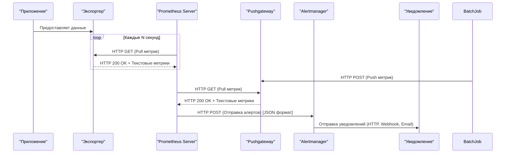

# Prometheus

## Введение
### Как работает Prometheus и для чего он нужен

**Prometheus** — это система мониторинга с открытым исходным кодом, созданная для сбора и анализа метрик производительности систем и приложений. Он был разработан специально для работы в условиях микросервисной архитектуры и активно используется в экосистеме Kubernetes.

### **Для чего нужен Prometheus:**
- **Мониторинг производительности:** Отслеживание метрик производительности серверов, контейнеров, баз данных, приложений.
- **Обнаружение проблем:** Быстрое выявление проблем в работе системы через алертинг и анализ метрик.
- **Оптимизация ресурсов:** Анализ использования ресурсов (CPU, память, диск, сеть) для оптимизации инфраструктуры.
- **Прогнозирование:** Использование исторических данных для прогнозирования будущих нагрузок и планирования масштабирования.
- **Интеграция с микросервисами:** Простая интеграция с современными архитектурами, такими как Kubernetes, Docker, и другие облачные платформы.

### **Как работает Prometheus:**
1. **Сбор данных**:
   - Prometheus периодически выполняет скрейпинг метрик с целевых систем через экспортеры.
   - Метрики предоставляются в формате временных рядов, где каждая точка данных связана с меткой времени.
2. **Хранение данных**:
   - Собранные метрики сохраняются во встроенной базе данных временных рядов (TSDB).
   - Данные организованы в блоки, каждый из которых охватывает конкретный временной интервал.
3. **Анализ данных**:
   - Prometheus предоставляет язык запросов PromQL для анализа и агрегации данных.
   - Пользователи могут выполнять сложные запросы для получения статистики, расчета производных показателей и построения графиков.
4. **Управление алертами**:
   - Prometheus отправляет алерты в Alertmanager, если заданные условия нарушаются.
   - Alertmanager обрабатывает алерты, группирует их и направляет уведомления через настроенные каналы.
5. **Долгосрочное хранение**:
   - Для архивации данных за пределами TSDB можно использовать внешние системы хранения, такие как Thanos или Cortex.
6. **Визуализация**:
   - Prometheus может работать с Grafana для создания дашбордов, что позволяет наглядно представлять данные о производительности.

---

### **Схема работы Prometheus**

Эта схема показывает полный цикл работы Prometheus: от сбора метрик до отправки уведомлений через Alertmanager. Включает как pull-модель для экспортеров, так и push-модель для временных задач:
            

### Давайте разберем её детально:

1. **Приложение → Экспортер**: Приложение предоставляет данные через экспортеры, которые могут быть встроены или внешними инструментами, такими как Node Exporter или Custom Exporter.

2. **Prometheus → Экспортер (Pull)**: Prometheus периодически запрашивает (скрейпит) метрики у экспортеров по расписанию, используя pull-модель. Это означает, что сам сервер Prometheus инициирует запросы к HTTP-интерфейсам экспортеров для получения актуальных данных.

3. **BatchJob → Pushgateway (Push)**: Временные задачи (BatchJobs), которые не могут быть постоянно доступны для скрейпинга из-за своей кратковременной природы, отправляют свои метрики напрямую в Pushgateway через push-модель. Это позволяет сохранить метрики до тех пор, пока они не будут собраны Prometheus. Отправка метрик осуществляется посредством HTTP POST-запросов к определенному URL Pushgateway, где метрики передаются в формате, совместимом с Prometheus (Prometheus text-based format, OpenMetrics).

5. **Prometheus → Pushgateway (Pull)**: Несмотря на то, что метрики были отправлены через push-модель, Prometheus всё ещё выполняет pull-операцию, забирая последние метрики из Pushgateway в соответствии со своим циклом скрейпинга. Таким образом, Pushgateway выступает как промежуточный буфер между временными задачами и Prometheus.

6. **Prometheus → Alertmanager**: После сбора данных, если определённые условия выполнены, Prometheus отправляет алерты в Alertmanager для дальнейшей обработки и управления уведомлениями.

7. **Alertmanager → Уведомление**: Alertmanager направляет уведомления через различные каналы, такие как email, Slack, или другие системы, чтобы информировать операторов о проблемах или событиях.

---

Приложения, использующие Pushgateway, должны иметь возможность формировать метрики в формате Prometheus и отправлять их через HTTP POST-запросы на соответствующий эндпоинт Pushgateway.

---
