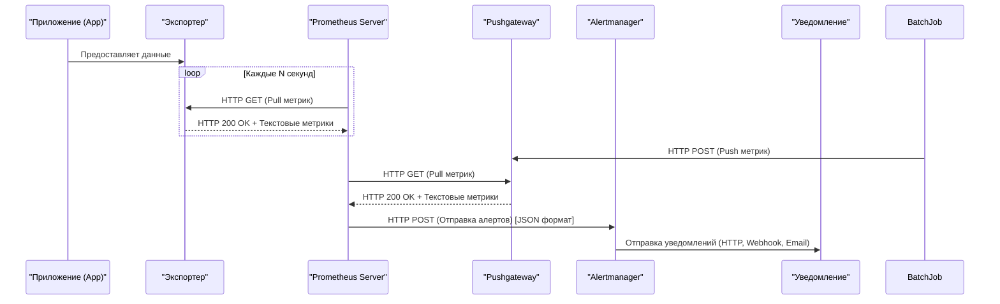

# Prometheus

## Введение
### Как работает Prometheus и для чего он нужен

**Prometheus** — это система мониторинга с открытым исходным кодом, созданная для сбора и анализа метрик производительности систем и приложений. Он был разработан специально для работы в условиях микросервисной архитектуры и активно используется в экосистеме Kubernetes.

### **Для чего нужен Prometheus:**
- **Мониторинг производительности:** Отслеживание метрик производительности серверов, контейнеров, баз данных, приложений.
- **Обнаружение проблем:** Быстрое выявление проблем в работе системы через алертинг и анализ метрик.
- **Оптимизация ресурсов:** Анализ использования ресурсов (CPU, память, диск, сеть) для оптимизации инфраструктуры.
- **Прогнозирование:** Использование исторических данных для прогнозирования будущих нагрузок и планирования масштабирования.
- **Интеграция с микросервисами:** Простая интеграция с современными архитектурами, такими как Kubernetes, Docker, и другие облачные платформы.

### **Как работает Prometheus:**
1. **Сбор данных**:
   - Prometheus периодически выполняет скрейпинг метрик с целевых систем через экспортеры.
   - Метрики предоставляются в формате временных рядов, где каждая точка данных связана с меткой времени.
2. **Хранение данных**:
   - Собранные метрики сохраняются во встроенной базе данных временных рядов (TSDB).
   - Данные организованы в блоки, каждый из которых охватывает конкретный временной интервал.
3. **Анализ данных**:
   - Prometheus предоставляет язык запросов PromQL для анализа и агрегации данных.
   - Пользователи могут выполнять сложные запросы для получения статистики, расчета производных показателей и построения графиков.
4. **Управление алертами**:
   - Prometheus отправляет алерты в Alertmanager, если заданные условия нарушаются.
   - Alertmanager обрабатывает алерты, группирует их и направляет уведомления через настроенные каналы.
5. **Долгосрочное хранение**:
   - Для архивации данных за пределами TSDB можно использовать внешние системы хранения, такие как Thanos или Cortex.
6. **Визуализация**:
   - Prometheus может работать с Grafana для создания дашбордов, что позволяет наглядно представлять данные о производительности.

---

### **Схема работы Prometheus**

Эта схема показывает полный цикл работы Prometheus: от сбора метрик до отправки уведомлений через Alertmanager. Включает как pull-модель для экспортеров, так и push-модель для временных задач:
            

### Давайте разберем ее детально:

1. **`App->>Exporter`**:  
     Протокол: **HTTP**  
     Запрос: **GET /metrics**  
     Формат ответа: **Prometheus text-based format** или **OpenMetrics**  

2.  **`Prometheus->>Exporter`**:  
   - Протокол: **HTTP**  
   - Запрос: **GET**  
   - Описание: Prometheus выполняет запрос `GET /metrics` к экспортеру для получения метрик в формате **Prometheus text-based format**.  

3. **`Exporter-->>Prometheus`**:  
   - Протокол: **HTTP**  
   - Ответ: **200 OK** + текстовые метрики  
   - Описание: Экспортер возвращает метрики в формате **Prometheus text-based format**.

4. **`BatchJob->>Pushgateway`**:  
   - Протокол: **HTTP**  
   - Запрос: **POST**  
   - Описание: Временная задача (BatchJob) отправляет свои метрики в Pushgateway через запрос `POST /metrics/job/<job_name>` в формате **Prometheus text-based format** [[6]].

5. **`Prometheus->>Pushgateway`**:  
   - Протокол: **HTTP**  
   - Запрос: **GET**  
   - Описание: Prometheus скрейпит метрики из Pushgateway с помощью запроса `GET /metrics`.

6. **`Pushgateway-->>Prometheus`**:  
   - Протокол: **HTTP**  
   - Ответ: **200 OK** + текстовые метрики  
   - Описание: Pushgateway возвращает метрики в формате **Prometheus text-based format**.

7. **`Prometheus->>Alertmanager`**:  
   - Протокол: **HTTP**  
   - Запрос: **POST**  
   - Описание: Prometheus отправляет алерты в Alertmanager в формате **JSON**.

8. **`Alertmanager->>Notification`**:  
   - Протокол: Зависит от канала уведомления (например, HTTP, Webhook, Email).  
   - Описание: Alertmanager направляет уведомления через настроенные интеграции (Slack, Telegram, Email и т.д.).  

---

Приложения, использующие Pushgateway, должны иметь возможность формировать метрики в формате Prometheus и отправлять их через HTTP POST-запросы на соответствующий эндпоинт Pushgateway.

---
