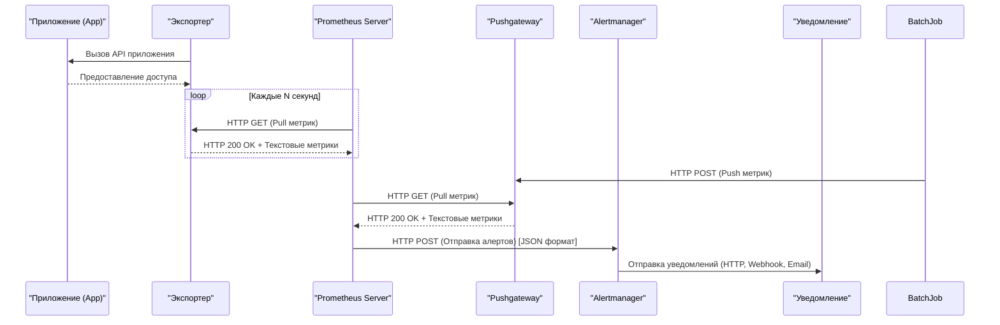
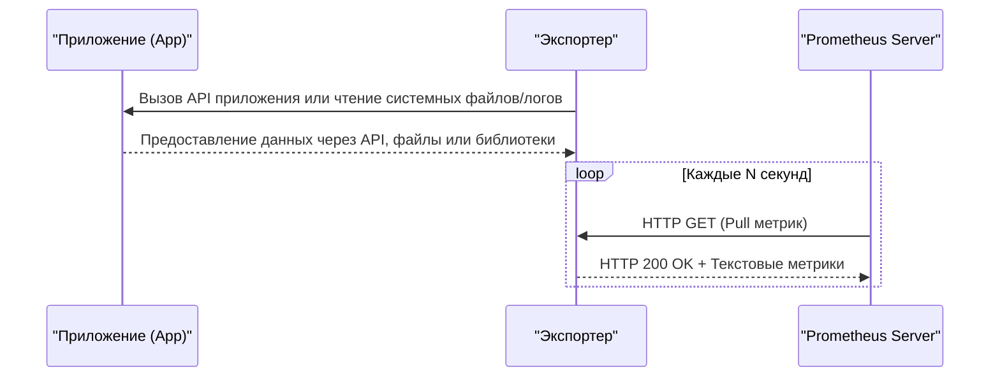
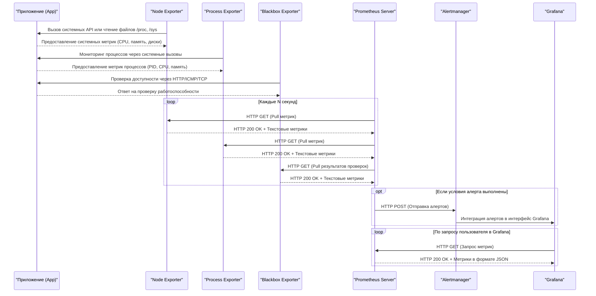

# Prometheus

## Введение
### Как работает Prometheus и для чего он нужен

**Prometheus** — это система мониторинга с открытым исходным кодом, созданная для сбора и анализа метрик производительности систем и приложений. Он был разработан специально для работы в условиях микросервисной архитектуры и активно используется в экосистеме Kubernetes.

### **Для чего нужен Prometheus:**
- **Мониторинг производительности:** Отслеживание метрик производительности серверов, контейнеров, баз данных, приложений.
- **Обнаружение проблем:** Быстрое выявление проблем в работе системы через алертинг и анализ метрик.
- **Оптимизация ресурсов:** Анализ использования ресурсов (CPU, память, диск, сеть) для оптимизации инфраструктуры.
- **Прогнозирование:** Использование исторических данных для прогнозирования будущих нагрузок и планирования масштабирования.
- **Интеграция с микросервисами:** Простая интеграция с современными архитектурами, такими как Kubernetes, Docker, и другие облачные платформы.

### **Как работает Prometheus:**
1. **Сбор данных**:
   - Prometheus периодически выполняет скрейпинг метрик с целевых систем (с таргетов) через экспортеры.
   - Метрики предоставляются в формате временных рядов, где каждая точка данных связана с меткой времени.
2. **Хранение данных**:
   - Собранные метрики сохраняются во встроенной базе данных временных рядов (TSDB).
   - Данные организованы в блоки, каждый из которых охватывает конкретный временной интервал.
3. **Анализ данных**:
   - Prometheus предоставляет язык запросов PromQL для анализа и агрегации данных.
   - Пользователи могут выполнять сложные запросы для получения статистики, расчета производных показателей и построения графиков.
4. **Управление алертами**:
   - Prometheus отправляет алерты в Alertmanager, если заданные условия нарушаются.
   - Alertmanager обрабатывает алерты, группирует их и направляет уведомления через настроенные каналы.
5. **Долгосрочное хранение**:
   - Для архивации данных за пределами TSDB можно использовать внешние системы хранения, такие как Thanos или Cortex.
6. **Визуализация**:
   - Prometheus может работать с Grafana для создания дашбордов, что позволяет наглядно представлять данные о производительности.

---

### **Схема работы Prometheus**

Эта схема показывает полный цикл работы Prometheus: от сбора метрик до отправки уведомлений через Alertmanager. Включает как pull-модель для экспортеров, так и push-модель для временных задач:
            

### Давайте разберем ее детально:

1.  **`Exporter->>App`**:  
   - Экспортер инициирует сбор данных, используя различные механизмы:
     - **API**: Выполняет запросы к API приложения.
     - **Файлы**: Читает системные файлы, например `/proc` или `/sys`.
     - **Библиотеки**: Использует данные, зарегистрированные клиентскими библиотеками Prometheus внутри приложения.
2.  **`App-->>Exporter`**:  
   - Приложение предоставляет данные через соответствующий механизм:
     - Если используется API, то ответ приходит через этот интерфейс.
     - Если используются файлы, экспортер считывает их напрямую.
     - Если используются библиотеки, метрики становятся доступными через HTTP-интерфейс, предоставленный библиотекой.

3.  **`Prometheus->>Exporter`**:  
   - Протокол: **HTTP**  
   - Запрос: **GET**  
   - Описание: Prometheus выполняет запрос `GET /metrics` к экспортеру для получения метрик в формате **Prometheus text-based format**.  

3. **`Exporter-->>Prometheus`**:  
   - Протокол: **HTTP**  
   - Ответ: **200 OK** + текстовые метрики  
   - Описание: Экспортер возвращает метрики в формате **Prometheus text-based format**.

4. **`BatchJob->>Pushgateway`**:  
   - Протокол: **HTTP**  
   - Запрос: **POST**  
   - Описание: Временная задача (BatchJob) отправляет свои метрики в Pushgateway через запрос `POST /metrics/job/<job_name>` в формате **Prometheus text-based format**.

5. **`Prometheus->>Pushgateway`**:  
   - Протокол: **HTTP**  
   - Запрос: **GET**  
   - Описание: Prometheus скрейпит метрики из Pushgateway с помощью запроса `GET /metrics`.

6. **`Pushgateway-->>Prometheus`**:  
   - Протокол: **HTTP**  
   - Ответ: **200 OK** + текстовые метрики  
   - Описание: Pushgateway возвращает метрики в формате **Prometheus text-based format**.

7. **`Prometheus->>Alertmanager`**:  
   - Протокол: **HTTP**  
   - Запрос: **POST**  
   - Описание: Prometheus отправляет алерты в Alertmanager в формате **JSON**.

8. **`Alertmanager->>Notification`**:  
   - Протокол: Зависит от канала уведомления (например, HTTP, Webhook, Email).  
   - Описание: Alertmanager направляет уведомления через настроенные интеграции (Slack, Telegram, Email и т.д.).  

---

Приложения, использующие Pushgateway, должны иметь возможность формировать метрики в формате Prometheus и отправлять их через HTTP POST-запросы на соответствующий эндпоинт Pushgateway.

---

## Системы сбора данных: сравнительный анализ pull и push подходов

### Pull-модель в Prometheus

В pull-модели Prometheus действует как активный агент, который периодически запрашивает данные у целевых источников информации. Этот подход характеризуется следующими принципами:

1. **Инициация запросов**: Prometheus сервер самостоятельно инициирует процесс получения данных, обращаясь к конфигурируемым эндпоинтам, которые предоставляют экспонируемые метрики.
2. **Экспортёры метрик**: Целевые системы должны иметь специальные компоненты — экспортёры (exporters), которые преобразуют внутренние показатели производительности в формат, понятный Prometheus (обычно в виде текстовых файлов в HTTP).
3. **Регулярность и интервалы**: Prometheus выполняет запросы на основе заранее установленных интервалов времени (например, каждые 15 секунд), что обеспечивает постоянное обновление данных.
4. **Преимущества**:
   - Простота управления безопасностью, так как не требуется открывать дополнительные порты на клиентах для приема данных.
   - Возможность контроля над частотой сбора данных.
   - Устойчивость к временным сбоям в работе клиентских систем, так как Prometheus может повторить попытку извлечения данных позже.

### Push-модель в Prometheus

Push-модель представляет собой противоположный подход, где источники данных отправляют свои метрики непосредственно на сервер Prometheus или промежуточный компонент. Основные характеристики этой модели включают:

1. **Активная передача данных**: Вместо того чтобы ожидать запроса от Prometheus, приложения или сервисы отправляют свои метрики на сервер или на Pushgateway — специальный компонент Prometheus, предназначенный для приема push-метрик.
2. **Pushgateway**: Это промежуточный компонент, используемый для хранения временных метрик до момента их сбора Prometheus. Он особенно полезен для сценариев короткоживущих задач, таких как batch-процессы.
3. **Гибкость**: Подходит для ситуаций, когда традиционный pull-метод невозможен или затруднителен, например, если целевые системы находятся за NAT или брандмауэром.
4. **Ограничения**:
   - Требует дополнительной настройки для обеспечения безопасности передачи данных.
   - Может быть менее эффективным в условиях высокой нагрузки из-за необходимости координировать множество одновременных push-запросов.

### Сравнение моделей

| Критерий          | Pull-модель                                      | Push-модель                                       |
|-------------------|--------------------------------------------------|--------------------------------------------------|
| Инициатор         | Prometheus сервер                               | Клиентские системы или приложения                |
| Безопасность      | Более простая модель безопасности                 | Требует дополнительной защиты каналов связи       |
| Отказоустойчивость| Лучше переносит временные недоступности клиентов  | Зависит от стабильности работы клиентов          |
| Применимость      | Подходит для долгоживущих сервисов               | Идеальна для короткоживущих задач и batch-процессов|

### Расширенная схема с экспортерами

