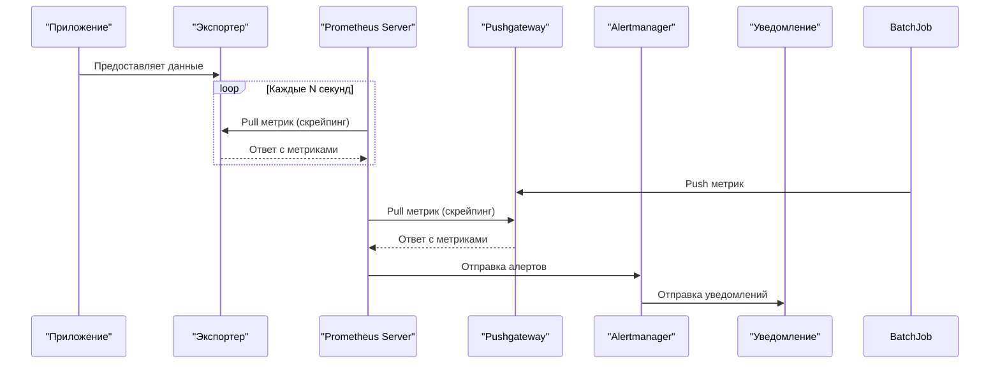

# Prometheus

## Введение
### Как работает Prometheus и для чего он нужен

**Prometheus** — это система мониторинга с открытым исходным кодом, созданная для сбора и анализа метрик производительности систем и приложений. Он был разработан специально для работы в условиях микросервисной архитектуры и активно используется в экосистеме Kubernetes. Ниже описаны основные компоненты системы:

1. **Целевые системы**: Это могут быть приложения, сервисы или инфраструктурные компоненты, которые предоставляют метрики через HTTP-интерфейсы.

2. **Экспортеры**: Экспортеры собирают метрики из целевых систем и предоставляют их в формате, понятном Prometheus. Например:
   - **Node Exporter** — для мониторинга ресурсов ОС.
   - **MySQL Exporter** — для мониторинга базы данных MySQL.

3. **Prometheus Server**:
   - Выполняет скрейпинг метрик с экспортеров.
   - Сохраняет данные во встроенной базе временных рядов (TSDB).
   - Позволяет выполнять запросы к данным с помощью PromQL.

4. **Pushgateway**:
   - Принимает метрики от временных задач (batch jobs) и предоставляет их Prometheus для скрейпинга.
   - Используется, когда целевая система недоступна для постоянного скрейпинга.

5. **Alertmanager**:
   - Получает алерты от Prometheus.
   - Группирует, фильтрует и направляет уведомления через внешние каналы (например, email, Slack, PagerDuty и Telegram).

6. **Внешние системы хранения** *(опционально)*:
   - Prometheus может быть настроен для отправки данных в удаленные хранилища (например, Thanos, Cortex или Mimir) для долгосрочного хранения.

---

### **Схема работы Prometheus**

            

---

### **Как работает Prometheus:**
1. **Сбор данных**:
   - Prometheus периодически выполняет скрейпинг метрик с целевых систем через экспортеры.
   - Метрики предоставляются в формате временных рядов, где каждая точка данных связана с меткой времени.
2. **Хранение данных**:
   - Собранные метрики сохраняются во встроенной базе данных временных рядов (TSDB).
   - Данные организованы в блоки, каждый из которых охватывает конкретный временной интервал.
3. **Анализ данных**:
   - Prometheus предоставляет язык запросов PromQL для анализа и агрегации данных.
   - Пользователи могут выполнять сложные запросы для получения статистики, расчета производных показателей и построения графиков.
4. **Управление алертами**:
   - Prometheus отправляет алерты в Alertmanager, если заданные условия нарушаются.
   - Alertmanager обрабатывает алерты, группирует их и направляет уведомления через настроенные каналы.
5. **Долгосрочное хранение**:
   - Для архивации данных за пределами TSDB можно использовать внешние системы хранения, такие как Thanos или Cortex.
6. **Визуализация**:
   - Prometheus может работать с Grafana для создания дашбордов, что позволяет наглядно представлять данные о производительности.

---

### Pull и Push модель в Prometheus

Prometheus использует **pull модель** по умолчанию, но также поддерживает использование **push модели** через дополнительные компоненты.

#### **Pull модель:**
- **Как работает:**
  - Prometheus регулярно запрашивает (pull) метрики у таргетов (целей), которые должны предоставлять их через HTTP-интерфейс.
  - Интервал опроса настраивается в конфигурационном файле Prometheus.
  - Таргеты могут быть статически настроены или автоматически обнаруживаться через сервисные открытия (service discovery).

- **Преимущества:**
  - Простота реализации: Prometheus управляет всем процессом сбора данных.
  - Надежность: Если таргет недоступен, Prometheus сразу об этом узнает и может сгенерировать алерт.
  - Меньше зависимости от сторонних компонентов.

- **Недостатки:**
  - Не всегда удобно использовать в сценариях, где таргеты находятся за NAT или брандмауэром.
  - Может быть сложно настроить для временных рабочих нагрузок (например, batch jobs).

#### **Push модель:**
- **Как работает:**
  - В push модели данные отправляются (push) в специальный компонент — **Pushgateway**.
  - Приложения или задачи отправляют свои метрики в Pushgateway, а Prometheus затем забирает эти данные с Pushgateway через pull.

- **Когда используется:**
  - Для временных рабочих нагрузок (например, batch jobs), которые не могут существовать достаточно долго для того, чтобы Prometheus мог их опросить.
  - Когда таргеты находятся за NAT или брандмауэром и недоступны напрямую для Prometheus.

- **Преимущества:**
  - Подходит для сценариев, где таргеты недолго существуют или находятся за ограничениями сети.
  - Упрощает работу с временными задачами.

- **Недостатки:**
  - Дополнительная сложность в архитектуре из-за необходимости использования Pushgateway.
  - Вероятность потери данных, если приложение завершается до того, как успело отправить метрики.

---

### Сравнение Pull и Push моделей:

| **Параметр** | **Pull модель** | **Push модель** |
|--------------|-----------------|-----------------|
| **Основной механизм** | Prometheus опрашивает таргеты | Таргеты отправляют данные в Pushgateway |
| **Когда использовать** | Для постоянных сервисов | Для временных задач или защищенных сетей |
| **Зависимость от доступности** | Требует доступности таргетов | Не требует постоянного доступа к таргетам |
| **Компоненты** | Только Prometheus | Prometheus + Pushgateway |
| **Сложность** | Простая | Сlightly более сложная |

---

- Prometheus в основном использует pull модель, которая является более надежной и простой в реализации для большинства случаев.
- Push модель через Pushgateway используется в специальных случаях, таких как временные задачи или ограниченные сетевые условия.
- Выбор между pull и push зависит от конкретных требований вашей инфраструктуры и типов мониторинга.

### **Для чего нужен Prometheus:**
- **Мониторинг производительности:** Отслеживание метрик производительности серверов, контейнеров, баз данных, приложений.
- **Обнаружение проблем:** Быстрое выявление проблем в работе системы через алертинг и анализ метрик.
- **Оптимизация ресурсов:** Анализ использования ресурсов (CPU, память, диск, сеть) для оптимизации инфраструктуры.
- **Прогнозирование:** Использование исторических данных для прогнозирования будущих нагрузок и планирования масштабирования.
- **Интеграция с микросервисами:** Простая интеграция с современными архитектурами, такими как Kubernetes, Docker, и другие облачные платформы.
