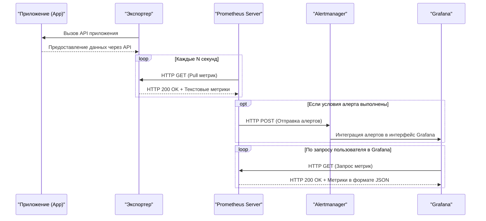

## **Alertmanager**  

**Alertmanager** — это компонент экосистемы Prometheus, предназначенный для управления алертами. Он принимает алерты от Prometheus, группирует их, подавляет ненужные уведомления и доставляет их в различные системы оповещения.

**Расширенная схема: Alertmanager и Grafana**

**Описание:**  
- Prometheus собирает метрики и проверяет условия алертов.
- Если условия выполнены, Prometheus отправляет алерты в Alertmanager.
- Alertmanager может интегрироваться с Grafana для отображения алертов.
- Grafana запрашивает метрики у Prometheus для визуализации.

#### Как работает:
Alertmanager работает следующим образом:
1. Prometheus отправляет алерты на Alertmanager, когда определенные условия выполняются (например, высокая загрузка CPU).
2. Alertmanager применяет правила маршрутизации для определения получателя уведомления.
3. Алерты могут быть сгруппированы по общим меткам (например, по сервису или окружению).
4. Alertmanager отправляет уведомления через настроенные каналы связи (email, Slack, PagerDuty, webhook и т.д.).

#### Основные функции:
- **Группировка алертов**: Объединяет связанные алерты для предотвращения "шума" (например, все алерты одного сервиса отправляются одним сообщением).
- **Mute-периоды**: Возможность временно отключать оповещения для определенных условий.
- **Отложенные оповещения**: Настраиваемые задержки перед отправкой уведомлений.
- **Маршрутизация**: Гибкая система правил для направления алертов разным получателям.
- **Эскалация**: Автоматическое повышение уровня важности алерта при отсутствии реакции.

#### Конфигурация:
Конфигурация Alertmanager происходит через YAML-файл, где можно задать:
- Маршруты оповещений.
- Ресиверы (получатели) для разных типов уведомлений.
- Настройки повторных отправок и mute-периодов.

#### Практическое применение:
- Отправка уведомлений в Slack о критических проблемах.
- Интеграция с системами incident management (например, PagerDuty).
- Автоматическое создание тикетов в Jira при возникновении проблем.

#### Преимущества:
- Централизованное управление алертами.
- Защита от информационного шума за счет группировки и эскалации.
- Гибкая настройка каналов оповещения.
