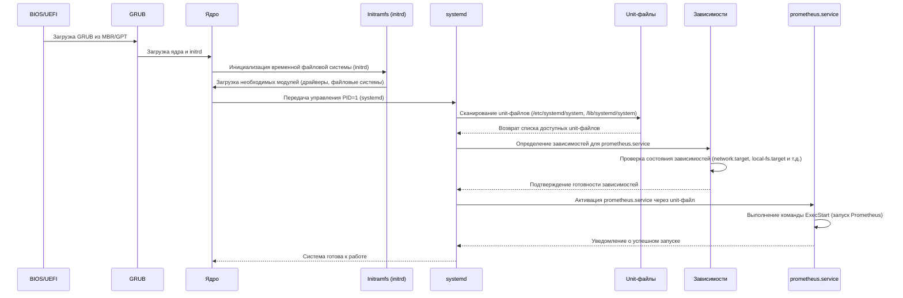

Схема описывает процесс загрузки операционной системы Linux, начиная от выполнения POST (Power-On Self Test) и заканчивая запуском службы Prometheus через системный менеджер `systemd`.

Ниже представлена диаграмма:



---

### Полное техническое описание схемы

---

#### 1. **Инициализация BIOS/UEFI**
   - **POST (Power-On Self Test)**: После включения питания система выполняет проверку аппаратных компонентов (RAM, процессор, устройства ввода-вывода). Если тест успешен, управление передается загрузчику.
   - **BIOS/UEFI**: Загрузчик ищет активный раздел на жестком диске (MBR для BIOS или GPT для UEFI) и загружает первичный загрузчик GRUB.

---

#### 2. **Загрузка GRUB**
   - **GRUB (Grand Unified Bootloader)**:
     - GRUB считывает конфигурационный файл `/boot/grub/grub.cfg`, который содержит информацию о доступных ядрах и параметрах загрузки.
     - Пользователь может выбрать ядро из меню GRUB. По умолчанию выбирается последнее установленное ядро.
   - **Загрузка ядра и initrd**:
     - GRUB загружает образ ядра (`vmlinuz`) и временный образ файловой системы (`initrd` или `initramfs`) в память.
     - `initrd` содержит минимальную файловую систему, необходимую для инициализации аппаратного обеспечения до монтирования корневой файловой системы.

---

#### 3. **Инициализация ядра**
   - **Загрузка ядра**:
     - Ядро Linux инициализируется, выполняя следующие шаги:
       - Установка базовых структур данных ядра.
       - Инициализация подсистем (например, планировщик процессов, управление памятью).
   - **Монтирование initrd**:
     - Ядро монтирует `initrd` как временную корневую файловую систему.
     - `initrd` содержит скрипты и модули ядра, необходимые для обнаружения и инициализации устройств (например, драйверы RAID, шифрования, сетевых интерфейсов).
   - **Передача управления init**:
     - После завершения работы `initrd` ядро монтирует реальную корневую файловую систему (например, `/dev/sda1`) и передает управление программе `init`.

---

#### 4. **Инициализация systemd**
   - **Передача управления PID=1**:
     - Программа `init` в современных системах реализована через `systemd`. Это первый процесс с PID=1, который управляет всеми остальными процессами.
   - **Сканирование unit-файлов**:
     - `systemd` читает конфигурационные файлы (unit-файлы) из следующих директорий:
       - `/etc/systemd/system`: Локальные пользовательские конфигурации.
       - `/lib/systemd/system`: Конфигурации по умолчанию, установленные пакетами.
       - `/run/systemd/system`: Динамические конфигурации, созданные во время выполнения.
     - Unit-файлы могут быть следующих типов:
       - `.service`: Описание служб.
       - `.target`: Цели (например, `multi-user.target`).
       - `.socket`: Сокеты для активации служб.
       - `.mount`: Точки монтирования.
       - `.device`: Устройства.
   - **Определение целей загрузки**:
     - `systemd` определяет целевую точку загрузки (например, `default.target`), которая указывает на уровень выполнения (runlevel). Обычно это `multi-user.target` для серверов.

---

#### 5. **Определение зависимостей**
   - **Анализ зависимостей**:
     - Для каждой службы `systemd` анализирует зависимости, указанные в секции `[Unit]` unit-файла:
       - `Requires`: Жесткая зависимость. Если зависимость не может быть выполнена, служба не запустится.
       - `Wants`: Мягкая зависимость. Служба запустится даже если зависимость недоступна.
       - `After`/`Before`: Указывает порядок запуска служб.
     - Например, для `prometheus.service` указаны зависимости:
       ```ini
       After=network.target local-fs.target
       Requires=local-fs.target
       ```
   - **Проверка состояния зависимостей**:
     - `systemd` проверяет состояние всех зависимостей (например, `network.target`, `local-fs.target`).
     - Если зависимость не активна, `systemd` активирует её (например, монтирует файловые системы или запускает сетевые службы).

---

#### 6. **Активация prometheus.service**
   - **Чтение unit-файла**:
     - `systemd` читает файл `/lib/systemd/system/prometheus.service`:
       ```ini
       [Unit]
       Description=Prometheus Monitoring System
       After=network.target local-fs.target
       Requires=local-fs.target

       [Service]
       User=prometheus
       Group=prometheus
       ExecStart=/usr/bin/prometheus --config.file=/etc/prometheus/prometheus.yml
       Restart=always

       [Install]
       WantedBy=multi-user.target
       ```
   - **Выполнение команды запуска**:
     - `systemd` выполняет команду, указанную в директиве `ExecStart`:
       ```bash
       /usr/bin/prometheus --config.file=/etc/prometheus/prometheus.yml
       ```
     - Процесс запускается от имени пользователя `prometheus` (указанного в директиве `User`).
   - **Мониторинг состояния**:
     - `systemd` продолжает мониторинг службы. Если процесс завершается с ошибкой, `systemd` перезапускает его (директива `Restart=always`).

---

#### 7. **Готовность системы**
   - **Уведомление о готовности**:
     - После успешного запуска всех служб, указанных в цели `multi-user.target`, система считается готовой к работе.
   - **Логирование**:
     - Все события записываются в журнал `journald`, который можно просмотреть с помощью команды:
       ```bash
       journalctl -u prometheus.service
       ```

---

### Технические замечания:
1. **Initrd**:
   - `initrd` используется для загрузки модулей ядра, необходимых для монтирования корневой файловой системы. После завершения работы `initrd` управление передается ядру, которое монтирует реальную корневую файловую систему.
2. **Systemd**:
   - `systemd` использует event-driven архитектуру, что позволяет параллельно запускать службы, минимизируя время загрузки.
3. **Unit-файлы**:
   - Unit-файлы являются основным механизмом управления службами в `systemd`. Они обеспечивают гибкость и контроль над процессами.

---

### Итог:
Схема описывает полный процесс загрузки системы, начиная от POST и заканчивая запуском службы Prometheus. Каждый этап подробно разобран с использованием технической терминологии, что позволяет глубже понять взаимодействие компонентов.
