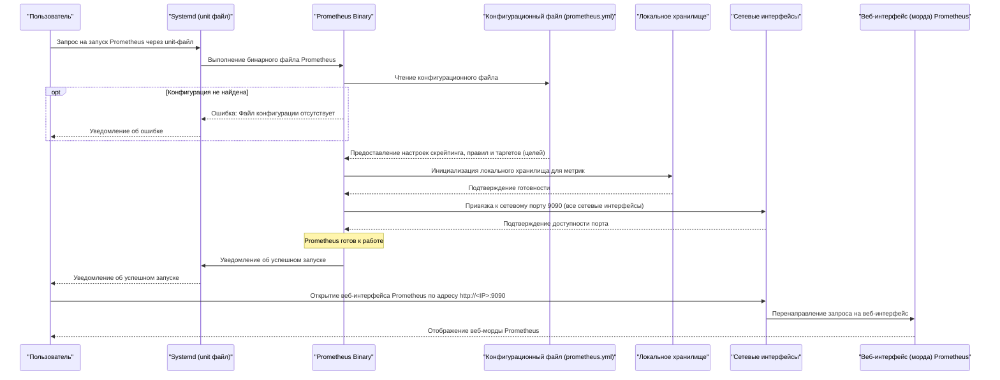

# Prometheus Backend

## Prometheus в схематичном разрезе запуска

### Техническое описание схемы запуска Prometheus

#### 1. **Инициация процесса через Systemd**
   - Процесс запуска Prometheus начинается с взаимодействия пользователя с системой управления службами `Systemd`. Пользователь инициирует запуск службы Prometheus, отправляя команду (например, `systemctl start prometheus`).
   - `Systemd` использует специальный *unit-файл* (обычно расположенный в `/etc/systemd/system/prometheus.service` или `/lib/systemd/system/prometheus.service`), который содержит конфигурацию для запуска Prometheus. Этот файл определяет параметры, такие как путь к бинарному файлу Prometheus, аргументы командной строки, права доступа, зависимости от других служб, условия автозапуска при загрузке системы и т.д.
   - После получения запроса на запуск, `Systemd` выполняет бинарный файл Prometheus, передавая ему необходимые параметры из unit-файла.

#### 2. **Чтение конфигурационного файла**
   - При запуске Prometheus обращается к своему основному конфигурационному файлу (`prometheus.yml`), который обычно находится в директории `/etc/prometheus/` или в пути, указанном в unit-файле через аргумент `--config.file`.
   - Конфигурационный файл содержит:
     - **Цели скрейпинга**: список экспортеров и сервисов, метрики которых будут собираться.
     - **Правила оценки**: пользовательские правила для создания дополнительных метрик или триггеров для алертов.
     - **Настройки хранения**: параметры локального хранилища данных.
     - **Настройки Alertmanager**: конфигурация для интеграции с системой оповещений.
   - Если файл `prometheus.yml` отсутствует или содержит ошибки, Prometheus завершает работу с соответствующим уведомлением, которое передается обратно через `Systemd` к пользователю.

#### 3. **Инициализация локального хранилища**
   - После успешного чтения конфигурационного файла Prometheus инициализирует локальное хранилище данных. По умолчанию данные сохраняются в директории `/var/lib/prometheus/`, но это можно переопределить через параметр `--storage.tsdb.path` в unit-файле или командной строке.
   - Локальное хранилище используется для сохранения собранных метрик в формате Time-Series Database (TSDB). Prometheus создает структуру каталогов для эффективного хранения и индексации данных.

#### 4. **Привязка к сетевому порту**
   - Prometheus привязывается к сетевому порту `9090` (или другому порту, если он явно указан через параметр `--web.listen-address`). Привязка осуществляется ко всем сетевым интерфейсам (`0.0.0.0:9090`), что делает его доступным через любую сеть, связанную с машиной.
   - На этом этапе Prometheus проверяет доступность порта. Если порт занят другим процессом, Prometheus завершится с ошибкой.

#### 5. **Готовность к работе**
   - После успешной инициализации всех компонентов (чтение конфигурации, подготовка хранилища, привязка к порту) Prometheus сообщает `Systemd` об успешном запуске. `Systemd`, в свою очередь, информирует пользователя о том, что служба успешно запущена.

#### 6. **Взаимодействие с веб-интерфейсом**
   - Prometheus предоставляет встроенный веб-интерфейс для мониторинга и анализа метрик. Пользователь может получить доступ к нему по адресу `http://<IP>:9090`, где `<IP>` — это IP-адрес машины, на которой запущен Prometheus.
   - Веб-интерфейс позволяет:
     - Выполнять запросы PromQL для анализа метрик.
     - Просматривать текущие таргеты скрейпинга и их статус.
     - Настройку правил алертов и просмотр состояния алертов.
     - Мониторинг производительности самого Prometheus (метрики self-monitoring).

#### 7. **Обработка запросов**
   - Когда пользователь открывает веб-интерфейс Prometheus через браузер, запрос направляется на порт `9090` через сетевые интерфейсы. Prometheus обрабатывает этот запрос и возвращает соответствующую страницу веб-морды.
   - Все данные, отображаемые в веб-интерфейсе, берутся из локального хранилища TSDB, которое было инициализировано на предыдущих этапах.

---

### Итоговое описание
Схема демонстрирует полный цикл запуска Prometheus, начиная от инициации через `Systemd` до предоставления веб-интерфейса для взаимодействия с пользователем. Ключевые этапы включают:
1. Запуск бинарного файла через unit-файл `Systemd`.
2. Чтение конфигурационного файла для настройки таргетов скрейпинга и правил.
3. Инициализацию локального хранилища данных.
4. Привязку к сетевому порту `9090` для обеспечения доступности веб-интерфейса.
5. Готовность к приему запросов через веб-морду для анализа метрик и управления системой мониторинга. 
