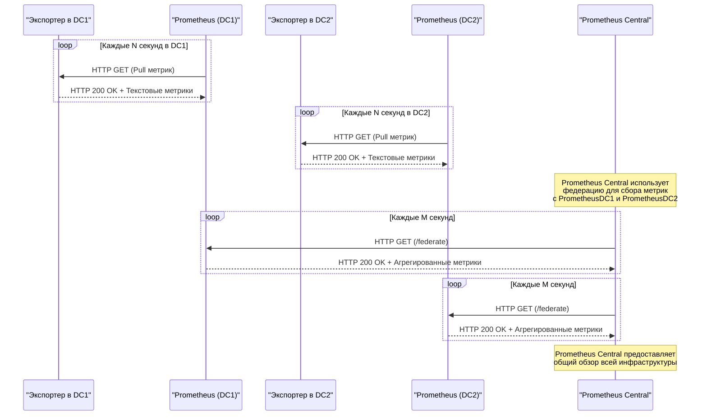

# Prometheus федерация

**Федерация Prometheus** представляет собой механизм горизонтального масштабирования и интеграции мониторинговых данных, позволяющий объединить несколько изолированных экземпляров Prometheus в единую систему для централизованного анализа и агрегации метрик. Этот подход основывается на принципах декомпозиции мониторинговой нагрузки, где каждый локальный экземпляр Prometheus отвечает за сбор и хранение метрик из определенной подсистемы или региональной инфраструктуры, а центральный экземпляр Prometheus использует специализированный endpoint `/federate` для выборочного получения ключевых метрик из этих локальных источников.

### Техническое описание

1. **Архитектурная сущность федерации**:
   - Федерация реализуется через RESTful API-интерфейс `/federate`, который предоставляет возможность запроса метрик из одного экземпляра Prometheus другим. Запросы поддерживают параметры фильтрации (например, `match[]`), что позволяет выбирать конкретные временные ряды (time series) на основе их меток (labels).
   - Локальные экземпляры Prometheus выступают в роли источников данных, предоставляя доступ к предварительно собранным метрикам, в то время как центральный экземпляр Prometheus выполняет роль агрегатора, формирующего общее представление о состоянии всей системы.

2. **Математическая модель**:
   - Пусть \( P_1, P_2, \ldots, P_n \) — множество локальных экземпляров Prometheus, каждый из которых собирает метрики \( M_{ij} \) для \( i \)-го экземпляра и \( j \)-го набора метрик.
   - Центральный экземпляр \( P_c \) использует функцию выборки \( F: \{M_{ij}\} \to \{M_c\} \), где \( M_c \) — агрегированный набор метрик, полученных из всех локальных экземпляров по заданным правилам фильтрации.

3. **Принцип работы**:
   - Каждый локальный экземпляр Prometheus независимо осуществляет скрапинг (scraping) метрик с помощью конфигурируемых job'ов и сохраняет их в своей временной базе данных TSDB (Time Series Database).
   - Центральный экземпляр Prometheus выполняет периодические HTTP-запросы к endpoint'ам `/federate` локальных экземпляров, указывая параметры фильтрации для ограничения объема передаваемых данных.
   - Передаваемые метрики могут быть преобразованы или агрегированы на уровне центрального экземпляра для обеспечения более эффективного использования ресурсов и уменьшения объема хранимых данных.

4. **Преимущества федерации**:
   - **Горизонтальное масштабирование**: Возможность разделения нагрузки между множеством экземпляров Prometheus, что особенно важно для крупных распределенных систем.
   - **Изолированность данных**: Локальные экземпляры могут работать автономно, минимизируя зависимость от центрального экземпляра и снижая риск отказа всей системы при сбоях в одном из компонентов.
   - **Гибкость агрегации**: Возможность выборочной передачи только необходимых метрик, что позволяет оптимизировать использование ресурсов и снизить сетевую нагрузку.

5. **Ограничения федерации**:
   - **Увеличение сложности**: Архитектура федерации требует тщательного планирования и конфигурирования, особенно при работе с большим количеством экземпляров Prometheus.
   - **Задержки агрегации**: Поскольку метрики передаются через HTTP, возможны временные задержки при обновлении данных в центральном экземпляре.
   - **Дублирование метрик**: При неаккуратной настройке могут возникнуть ситуации, когда одни и те же метрики передаются из нескольких источников, что приводит к дублированию данных.

6. **Применение федерации**:
   - Федерация широко используется в распределенных системах, таких как облачные платформы, географически разнесенные дата-центры или микросервисные архитектуры, где требуется разделение ответственности за мониторинг различных подсистем.

Таким образом, федерация Prometheus является мощным инструментом для создания масштабируемых и отказоустойчивых мониторинговых решений, обеспечивающих гибкость и эффективное управление данными в сложных распределенных средах.

Схема, демонстрирующая работу федерации **Prometheus** на трех экземплярах: `prometheus-central`, `prometheus-dc1` и `prometheus-dc2`. Эта схема показывает, как локальные экземпляры **Prometheus** собирают метрики из своих дата-центров, а центральный экземпляр **Prometheus** агрегирует ключевые метрики через механизм федерации.

### Объяснение схемы:

1. **Локальные экземпляры Prometheus (`PrometheusDC1` и `PrometheusDC2`)**:
   - Эти экземпляры собирают метрики из своих дата-центров (`DC1` и `DC2`) с помощью экспортеров (`ExporterDC1` и `ExporterDC2`).
   - Метрики собираются через стандартный pull-механизм Prometheus.

2. **Федерация**:
   - Центральный экземпляр Prometheus (`PrometheusCentral`) использует endpoint `/federate` для получения ключевых метрик от локальных экземпляров.
   - `PrometheusCentral` делает запросы к `PrometheusDC1` и `PrometheusDC2` с параметром `match[]`, чтобы выбрать нужные метрики.

3. **Агрегирование данных**:
   - `PrometheusCentral` агрегирует данные со всех дата-центров и предоставляет общий обзор всей инфраструктуры.

4. **Периодичность**:
   - Локальные экземпляры собирают метрики каждые `N` секунд.
   - Центральный экземпляр запрашивает метрики у локальных экземпляров каждые `M` секунд.

### Преимущества такой архитектуры:
- **Изолированность**: Каждый дата-центр имеет свой собственный экземпляр Prometheus, что снижает нагрузку и обеспечивает независимость.
- **Масштабируемость**: Можно легко добавить новые дата-центры и соответствующие экземпляры Prometheus.
- **Общий обзор**: Центральный экземпляр позволяет получать общую картину работы всей инфраструктуры. 
