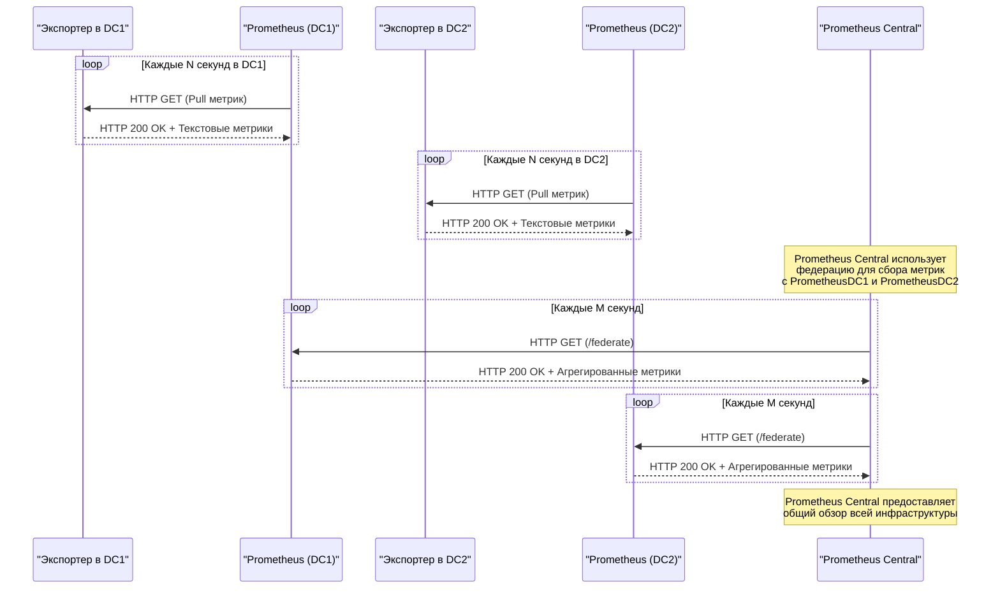

# Prometheus федерация

Схема, демонстрирующая работу федерации **Prometheus** на трех экземплярах: `prometheus-central`, `prometheus-dc1` и `prometheus-dc2`. Эта схема показывает, как локальные экземпляры **Prometheus** собирают метрики из своих дата-центров, а центральный экземпляр **Prometheus** агрегирует ключевые метрики через механизм федерации.

### Объяснение схемы:

1. **Локальные экземпляры Prometheus (`PrometheusDC1` и `PrometheusDC2`)**:
   - Эти экземпляры собирают метрики из своих дата-центров (`DC1` и `DC2`) с помощью экспортеров (`ExporterDC1` и `ExporterDC2`).
   - Метрики собираются через стандартный pull-механизм Prometheus.

2. **Федерация**:
   - Центральный экземпляр Prometheus (`PrometheusCentral`) использует endpoint `/federate` для получения ключевых метрик от локальных экземпляров.
   - `PrometheusCentral` делает запросы к `PrometheusDC1` и `PrometheusDC2` с параметром `match[]`, чтобы выбрать нужные метрики.

3. **Агрегирование данных**:
   - `PrometheusCentral` агрегирует данные со всех дата-центров и предоставляет общий обзор всей инфраструктуры.

4. **Периодичность**:
   - Локальные экземпляры собирают метрики каждые `N` секунд.
   - Центральный экземпляр запрашивает метрики у локальных экземпляров каждые `M` секунд.

### Преимущества такой архитектуры:
- **Изолированность**: Каждый дата-центр имеет свой собственный экземпляр Prometheus, что снижает нагрузку и обеспечивает независимость.
- **Масштабируемость**: Можно легко добавить новые дата-центры и соответствующие экземпляры Prometheus.
- **Общий обзор**: Центральный экземпляр позволяет получать общую картину работы всей инфраструктуры. 
