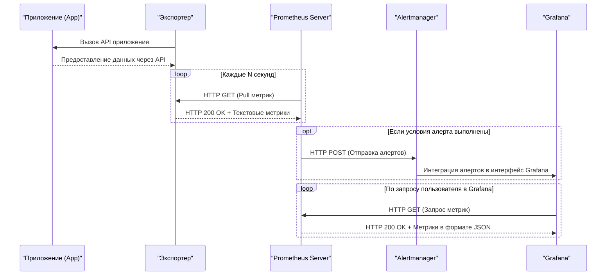
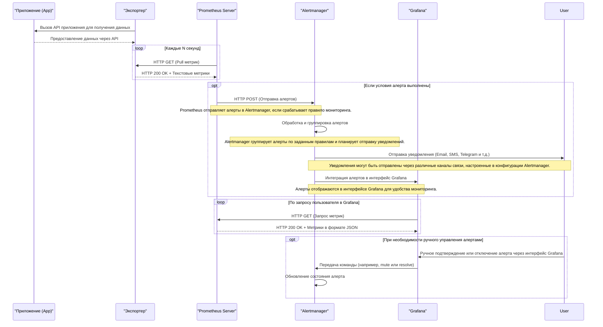

# Alerting в системе мониторинга Prometheus

**Alertmanager** — это компонент экосистемы Prometheus, который отвечает за обработку, группировку, подавление и отправку оповещений (алертов) на основе данных, полученных от Prometheus или других источников. Его основная задача — управлять потоком оповещений, чтобы избежать перегрузки пользователей или систем уведомлений, а также обеспечить удобное и своевременное информирование о проблемах.

### **Основные задачи Alertmanager:**
1. **Группировка оповещений**:
   - Объединяет несколько связанных оповещений в одно, чтобы избежать дублирования и уменьшить количество уведомлений.
   - Например, если несколько серверов одновременно сообщают о проблеме, Alertmanager может отправить одно общее уведомление.

2. **Подавление оповещений (Inhibition)**:
   - Подавляет менее важные оповещения, если уже сработало более критическое.
   - Например, если сработал алерт о недоступности всего кластера, то оповещения о проблемах на отдельных узлах могут быть подавлены.

3. **Маршрутизация оповещений (Routing)**:
   - Направляет оповещения разным получателям (например, в разные каналы Slack, Telegram, email) в зависимости от меток (labels) и правил маршрутизации.

4. **Повторная отправка оповещений**:
   - Если проблема не решена, Alertmanager может повторно отправлять оповещения через заданные интервалы времени.

5. **Обработка состояний "Resolved"**:
   - Отправляет уведомления о том, что проблема была решена (если это настроено).

---

### **Основные компоненты Alertmanager:**

1. **Конфигурационный файл (`alertmanager.yml`)**:
   - Определяет, как Alertmanager должен обрабатывать и отправлять оповещения.
   - Включает настройки:
     - **Глобальные параметры** (например, время разрешения оповещений).
     - **Маршруты (routes)** — правила маршрутизации оповещений.
     - **Получатели (receivers)** — каналы отправки уведомлений (Slack, Telegram, email и т.д.).
     - **Правила подавления (inhibit_rules)** — условия для подавления менее важных оповещений.

2. **API Alertmanager**:
   - Предоставляет интерфейс для управления оповещениями, их статусами и конфигурацией.
   - Используется для интеграции с другими системами.

3. **Веб-интерфейс**:
   - Позволяет просматривать текущие оповещения, их статусы и настройки маршрутизации.

4. **Интеграции с каналами уведомлений**:
   - Поддерживает множество каналов для отправки оповещений, таких как:
     - Slack
     - Telegram
     - Email
     - PagerDuty
     - Webhook (для интеграции с другими системами)

---

### **Как работает Alertmanager:**
1. Prometheus отправляет оповещения в Alertmanager на основе правил, определенных в `alert.rules`.
2. Alertmanager принимает эти оповещения и применяет к ним правила маршрутизации, группировки и подавления.
3. В зависимости от конфигурации, Alertmanager отправляет уведомления в соответствующие каналы (например, в Telegram или Slack).
4. Если проблема решена, Prometheus отправляет соответствующий сигнал, и Alertmanager может уведомить об этом.

---

### **Преимущества Alertmanager:**
- **Гибкость**: Настройка маршрутизации и группировки под конкретные нужды.
- **Масштабируемость**: Обработка большого количества оповещений без перегрузки пользователей.
- **Интеграция**: Поддержка множества каналов уведомлений.
- **Подавление шума**: Уменьшение количества уведомлений за счет группировки и подавления.
---

### Схема: Alertmanager + Grafana

**Описание схемы:**  
- Prometheus собирает метрики и проверяет условия алертов.
- Если условия выполнены, Prometheus отправляет алерты в Alertmanager.
- Alertmanager может интегрироваться с Grafana для отображения алертов.
- Grafana запрашивает метрики у Prometheus для визуализации.

---

### Расширенная схема работы Alertmanager c дополнительным описанием того, как работает вся система:

### Описание процессов на схеме:

1. **Получение метрик из приложения через экспортер**:
   - Приложение предоставляет данные через свой API, который вызывается экспортером.
   - Экспортер преобразует эти данные в формат, понятный Prometheus, и предоставляет их для сбора.

2. **Сбор метрик Prometheus**:
   - Prometheus регулярно запрашивает метрики у экспортера через HTTP-запросы (pull-модель).
   - Полученные метрики сохраняются в базе данных Prometheus для дальнейшего анализа.

3. **Обработка алертов Prometheus и Alertmanager**:
   - Если выполняются условия, определенные в правилах алертинга Prometheus, сервер отправляет алерты в Alertmanager.
   - Alertmanager обрабатывает алерты, группируя их по заданным параметрам (например, по сервису, окружению или уровню критичности).
   - После группировки Alertmanager отправляет уведомления через настроенные каналы связи (например, email, SMS, Telegram и т.д.).

4. **Интеграция с Grafana**:
   - Alertmanager интегрируется с Grafana, чтобы алерты отображались в интерфейсе Grafana.
   - Пользователи могут просматривать статус алертов и детали метрик в Grafana.

5. **Запрос метрик из Grafana**:
   - Когда пользователь открывает панель мониторинга в Grafana, она отправляет запрос к Prometheus за актуальными данными.
   - Prometheus возвращает метрики в формате JSON, которые затем отображаются на графиках в Grafana.

6. **Ручное управление алертами**:
   - Пользователь может взаимодействовать с алертами через интерфейс Grafana, например, подтвердить получение уведомления или временно отключить алерт.
   - Команды передаются в Alertmanager, который обновляет состояние алерта соответственно.

### Примечания:
- Конфигурация Alertmanager позволяет настраивать сложные маршруты для доставки уведомлений в зависимости от уровня важности, времени суток, типа инцидента и других факторов.
- Prometheus и Alertmanager работают независимо, но тесно интегрированы друг с другом для обеспечения надежной системы мониторинга и оповещения.
