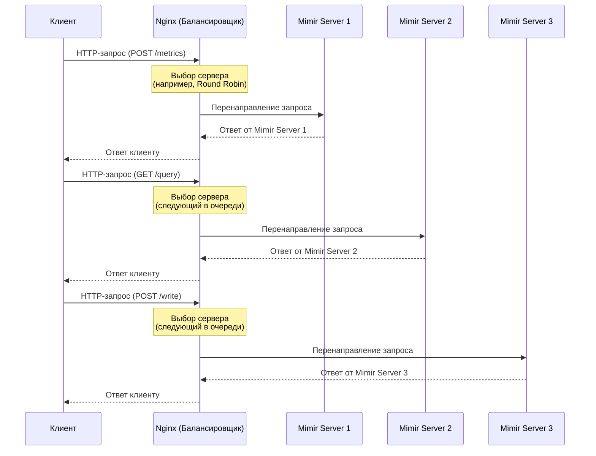

# **Nginx: Подробное определение и преимущества**

## **Что такое Nginx?**  

**NGINX** (произносится как *"engine-x"*) — это высокопроизводительный **веб-сервер**, **обратный прокси**, **балансировщик нагрузки** и **кеширующий прокси-сервер** с открытым исходным кодом. Разработанный Игорем Сысоевым в 2004 году, NGINX изначально создавался для решения проблемы **C10K** (обслуживание 10 000 одновременных соединений), с которой традиционные серверы (например, Apache) не справлялись эффективно.  

Сегодня NGINX используется миллионами сайтов, включая такие гиганты, как **Netflix, Dropbox, WordPress.com, GitHub** и другие высоконагруженные платформы.  

### **🔹 Основные функции NGINX:**  
1. **Веб-сервер** — обслуживает статические и динамические веб-страницы.  
2. **Обратный прокси** — перенаправляет запросы к бэкенд-серверам (Node.js, PHP-FPM, Python и др.).  
3. **Балансировщик нагрузки** — распределяет трафик между несколькими серверами.  
4. **Кеширование** — ускоряет загрузку страниц, сохраняя часто запрашиваемые данные.  
5. **Сжатие и оптимизация** — уменьшает размер передаваемых данных (Gzip, Brotli).  
6. **Защита от DDoS** — ограничение запросов, блокировка ботов.  
7. **Поддержка HTTP/2 и HTTPS** — современные протоколы для быстрой и безопасной передачи данных.  

---

Пример схемы последовательности (sequence diagram) в формате **Mermaid**, которая демонстрирует, как Nginx работает в качестве балансировщика нагрузки для трех серверов Mimir (что такое Mimir мы будем знакомиться в репозитории Docker, [читаем пока только теорию](https://github.com/lamjob1993/docker-monitoring/tree/main/mimir)). В данном случае клиент отправляет запрос к Nginx, который распределяет его между тремя серверами Mimir.

---

### Объяснение схемы:

1. **Клиент** отправляет HTTP-запрос (например, `POST /metrics` или `GET /query`) на Nginx.
2. **Nginx** принимает запрос и выбирает один из серверов Mimir для перенаправления запроса. В данном примере используется алгоритм **Round Robin** (поочередное распределение запросов).
   - Первый запрос отправляется на **Mimir Server 1**.
   - Второй запрос отправляется на **Mimir Server 2**.
   - Третий запрос отправляется на **Mimir Server 3**.
3. Выбранный сервер Mimir обрабатывает запрос и отправляет ответ обратно Nginx.
4. Nginx передает ответ клиенту.

---

### Примечания:
- **Алгоритмы балансировки**: Вместо Round Robin можно использовать другие алгоритмы, такие как `least_conn` (выбор сервера с наименьшим количеством активных подключений), `ip_hash` (привязка клиента к конкретному серверу по IP) или `hash` (распределение на основе хэша запроса).
- **Отказоустойчивость**: Если один из серверов Mimir становится недоступным, Nginx автоматически перенаправляет запросы на оставшиеся серверы.
- **Масштабируемость**: Эта схема легко масштабируется за счет добавления новых серверов Mimir.

---

## **Преимущества NGINX**  

### **1. Высокая производительность и масштабируемость**  
- **Асинхронная архитектура** (event-driven) вместо потоковой модели (thread-per-connection), как у Apache.  
- Эффективно обрабатывает **десятки тысяч соединений** одновременно.  
- Потребляет **меньше оперативной памяти** и CPU по сравнению с Apache.  

### **2. Гибкость и универсальность**  
- Может работать как:  
  - **Веб-сервер** (статический контент, FastCGI для PHP/Python).  
  - **Прокси-сервер** (переадресация на бэкенд: Node.js, Java, Go).  
  - **Балансировщик нагрузки** (Round Robin, Least Connections, IP Hash).  
  - **Кеширующий сервер** (ускоряет API и статику).  
- Поддерживает **HTTP/2, WebSocket, gRPC**.  

### **3. Надежность и отказоустойчивость**  
- **Автоматическое восстановление** при падении бэкенд-серверов.  
- **Health checks** — проверка работоспособности серверов в кластере.  
- **Graceful restart** — обновление конфигурации без остановки сервера.  

### **4. Безопасность**  
- Встроенная защита от **DDoS** (ограничение запросов, rate limiting).  
- Поддержка **TLS 1.3**, HTTPS по умолчанию.  
- Возможность настройки **WAF** (Web Application Firewall) через модули.  

### **5. Оптимизация загрузки**  
- **Кеширование** статики и динамического контента.  
- **Сжатие** (Gzip, Brotli) для уменьшения трафика.  
- **Быстрая раздача статических файлов** (CSS, JS, изображения).  

### **6. Простота конфигурации**  
- Читаемый **синтаксис конфигов** (легче, чем Apache `.htaccess`).  
- Поддержка **динамической перезагрузки** (`nginx -s reload`).  
- Модульность (можно отключать ненужные функции).  

### **7. Поддержка облачных и микросервисных архитектур**  
- Интеграция с **Docker, Kubernetes, AWS, Cloudflare**.  
- Подходит для **API Gateway** (маршрутизация запросов к микросервисам).  

---

NGINX — это **мощный, быстрый и надежный** сервер, который подходит как для небольших сайтов, так и для высоконагруженных проектов. Его **гибкость, производительность и безопасность** делают его одним из лучших решений для современного веба.  

**Где применяется?**  
- Хостинг статических сайтов (HTML, CSS, JS).  
- Проксирование API (Node.js, Django, Flask).  
- Балансировка нагрузки в кластерах.  
- Ускорение WordPress, Magento, Drupal.  
- Защита и оптимизация веб-приложений.  
